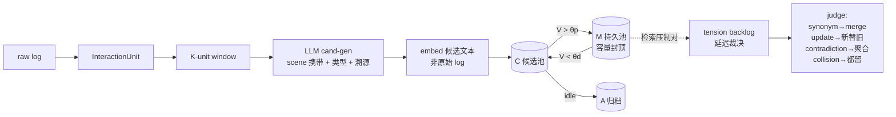

# Dynamics-memory

LLM agent 的有界自纠错长期记忆层——把连续、 noisy、前后矛盾的项目交互日志，
蒸馏成一个不会堆成"史山"的记忆库。

**Core idea**: raw logs are not memory. Logs feed an LLM candidate generator;
only distilled memory text is embedded and admitted — through a candidate pool —
into a bounded persistent pool governed by value dynamics (decay, reinforcement,
promotion, demotion, eviction) and explicit contradiction handling.

## 问题

agent 的 context 本身没有记忆。直接把交互 log 全量塞进向量库会迅速堆积成
冗余、过期、互相矛盾的"史山"：检索被重复副本淹没、旧信息压过新状态、
context 效率持续劣化。目标不是"记住所有细节"，而是维持**项目进度感与痛点**
的活性表征——新窗口里用户说一句"接着搞"，系统就知道进行到哪了。

## 架构



- **双池 + 值动力学**：`V ← V·e^(−λ) + η·hit + η_s·shadow`，晋升/降级滞回
  （θp > θd），容量驱逐，闲置归档——M 池有界且自我更新；
- **检索内压制即检测**：过相似未入选的对全部进 tension backlog，冲突在
  检索时自然暴露，不需要单独扫描；
- **矛盾处理**：同实体矛盾收编进**聚合 memory**（内含全部版本+时间戳，
  `pending_review` 等人工/LLM 终裁）；找得到作用域则条件化合并；
- **未决冲突不许自信出场**：入选记忆带未决 tension 时，对手版本随答案
  一并端给下游（contested co-serve）；
- **溯源**：每条记忆携带 `src` 源单元 id，检索级 evidence recall 可直接算。

## 目录

```text
hybrid_memory/    包本体：core（引擎）/ candgen / embed / semantics / sim / datasets
experiments/      驱动脚本 + paths.py（产物目录常量）+ out/（cache/candgen/runs/qa/bench/tmp）
data/             输入（原始日志与大体积 benchmark 不入库，见 .gitignore）
tests/            pytest
```

## 评测（因果约束回放）

t 时刻的提问只能用 t 之前流入的记忆回答——无前窥。在真实 6 周项目日志
（106 个交互单元）上：

| 评测 | 结果 |
|---|---|
| 续话感（真实后续提问，1-5 分） | **memory 3.00** / flat-log 2.39 / none 2.23；≥4 分率 38% vs 8% |
| 原始日志出题 QA（36 题） | acc **0.667**，拒答 3/3 全对 |
| LoCoMo（跨分布对照） | 0.29——暴露了蒸馏丢细节与"单次问答"协议错位 |

已知边界（诚实口径）：n 小的方向性证据而非决定性证据；真实数据的
semantic judge 目前只有 verbatim 规则，update/evid 回路待 LLM 裁判接入；
archive 池尚无界。

## 复现

```bash
pip install numpy pytest
cp .env.example .env   # ZAI_API_KEY=...
python -m pytest tests                              # 机制单测
python -m experiments.candgen_real                  # 窗口 → 候选（LLM）
python -m experiments.run_real --allow-remote       # 因果回放
python -m experiments.qa_real --allow-remote        # 原始日志出题 QA
python -m experiments.qa_continuity --allow-remote  # 续话感三组对照
python -m experiments.run_bench --dataset locomo --limit 1
```
