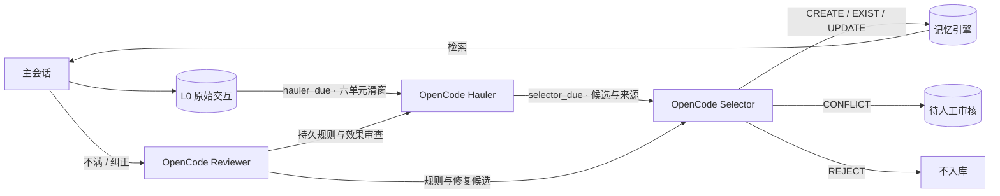
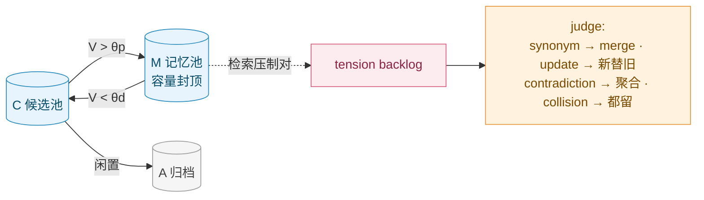

<div align="center">

# Dynamics-memory

**LLM agent 的有界长期记忆层**

把连续、嘈杂、前后矛盾的项目交互，蒸馏成一个不会堆成"史山"的记忆库。<br/>
新会话里一句"接着搞"，agent 就知道进行到哪、上次卡在哪。


[架构](#架构默认-opencode-三-agent-工作协议) · [动力学](#记忆动力学) · [验证状态](#验证状态) · [运行](#运行) · [设计文档](docs/ouroboros.md)

</div>

---

## 30 秒上手

```bash
pip install numpy pytest
cp .env.example .env          # ZAI_API_KEY=...

python -m pytest tests/                          # 本地测试；不是远程验证
python -m hybrid_memory.server --project <dir>   # 或被 opencode 插件自动拉起
```

接入 opencode（官方 CLI 即可，无需源码）：

```bash
npm i -g opencode-ai
cd <本仓库> && opencode        # .opencode/plugin/memory-bridge.ts 自动加载并拉起 sidecar
```

<sub>给别的项目用：把 `memory-bridge.ts` 软链到 `<项目>/.opencode/plugin/`。插件的
`@opencode-ai/plugin` 依赖按软链的真实路径解析，所以要先在本仓库里跑一次 opencode
（或 `cd .opencode && npm i @opencode-ai/plugin`）让依赖装好。</sub>

```text
交互回合 ──observe──→ L0 持久日志 → hauler_due → OpenCode Hauler
候选批次 ──selector_due──→ OpenCode Selector → 五路分流 → 记忆／人审
用户不满 ──reviewer_due──→ OpenCode Reviewer → 诊断／版本化规则
问答     ──search───→ top-k 记忆注入（<relevant-memories> 块）
```

## 为什么不用现成的两条路

| 路线 | 死因 |
|---|---|
| 全量 log 塞 context | 每轮付 O(log) 的 prefill+KV 扫描，随项目历史线性变贵 |
| 原文入向量库 | 冗余、过期、互相矛盾的副本堆成史山，旧状态压过新状态 |

**log 不是记忆，log 是证据。** 记忆是蒸馏产物，进池要过动力学与置信门控；
日志留在 L0 冷层，只在需要时按计量回展——永不整段进 prompt。

## 架构：默认 OpenCode 三 Agent 工作协议


```mermaid
flowchart LR
  U[主会话] --> L0[(L0 原始交互)]
  L0 -->|hauler_due · 六单元滑窗| H[OpenCode Hauler]
  H -->|selector_due · 候选与来源| S[OpenCode Selector]
  S -->|CREATE / EXIST / UPDATE| M[(记忆引擎)]
  S -->|CONFLICT| R[(待人工审核)]
  S -->|REJECT| X[不入库]
  U -->|不满 / 纠正| V[OpenCode Reviewer]
  V -->|持久规则与效果审查| H
  V -->|规则与修复候选| S
  M -->|检索| U
```

信号只负责持久交接、租约和幂等；三份 `.opencode/agent/*.md` 定义
负责语义判断。重叠滑窗按 L0 来源单元去重，冲突须人审。默认模式下主 agent
不能绕过 Selector 直接调用 `/propose` 或 `/resolve`。
完整协议、审核入口、恢复及已知边界见 [OpenCode 三 Agent 文档](docs/opencode-trio.md)。

旧的单轮 candgen 和 sidecar 内调查员仅在 `MEMORY_PIPELINE=legacy` 时使用。
其设计记录见 [衔尾蛇说明](docs/ouroboros.md)，不能把旧记录当作默认模式的验证。

## 记忆动力学


```mermaid
flowchart LR
    C[("C 候选池")] -->|"V &gt; θp"| M[("M 记忆池<br/>容量封顶")]
    M -->|"V &lt; θd"| C
    C -->|"闲置"| A[("A 归档")]
    M -. "检索压制对" .-> T["tension backlog"]
    T --> J["judge:<br/>synonym → merge · update → 新替旧<br/>contradiction → 聚合 · collision → 都留"]

    classDef pool fill:#E8F4FD,stroke:#2B8CBF,color:#0B4F6C
    classDef cold fill:#F5F5F5,stroke:#9E9E9E,color:#424242
    classDef hot fill:#FDECEF,stroke:#D65F7F,color:#8A2444
    classDef judge fill:#FFF3E0,stroke:#E8963C,color:#7A4A00
    class C,M pool
    class A cold
    class T hot
    class J judge
```

| 机制 | 一句话 |
|---|---|
| 价值 × 置信分离 | `V ← V·e^(−λ) + η·hit + η_s·shadow`；高价值定半衰期，置信达标才服务——高价值低置信"活着但不用" |
| 滞回 + 驱逐 + 归档 | θp>θd 防抖，容量封顶，闲置进冷层——M 池有界且自我更新 |
| 压制即检测 | 过相似未入选对自动进 tension backlog，冲突检索时自然暴露 |
| 矛盾不静默 | 同实体矛盾聚合收编（全版本+时间戳），未决 conflict 不许自信出场（contested co-serve） |
| 可溯源 | 每条记忆携带源单元 id，可回 L0 查证；`origin` 纯审计不给 V 加成 |

## 评测

评测平台 **TIDE** 与引擎完全分离（只经 HTTP 协议通信，真值不越过边界）。
设计见 [`docs/benchmark-design.md`](docs/benchmark-design.md)，
第一版可运行实现在 [`eval/`](eval/README.md)（场景驱动器 + 离线 mock + 基线报告）。

sidecar 为评测提供的两个能力：

| 参数 | 端点 | 作用 |
|---|---|---|
| `passive` | `GET /recall?passive=1` / `POST /search {"passive": true}` | 在引擎副本上检索：不改任何状态、不登记 retrieval_id（评测探针用） |
| `budget_tokens` | 同上 | 上下文按 `approx_tokens` 计数截断整行（CJK 单字 / ASCII 词 / 符号各记 1） |

<sub>旧的 experiments/ 评测已整体移除：其仿真与引擎共用真值对象、口径无法识别聚合输出、
样本量不足以支持结论，数字不再引用。</sub>

## 配置

| 环境变量 | 默认 | 作用 |
|---|---|---|
| `MEMORY_PIPELINE` | opencode | `legacy` 启用旧单轮 candgen 和进程内调查员 |
| `MEMORY_AGENT` | on | `off` 暂停后台 agent，任务仍持久等待 |
| `MEMORY_AGENT_DAILY_CAP` | 200 | 仅 legacy 调查员的日调用上限 |
| `MEMORY_AGENT_MODEL` | glm-5.3-flash | 仅 legacy 调查员模型 |
| `MEMORY_OPENCODE_BIN` | opencode | OpenCode CLI 路径（需配置自己的模型 provider） |
| `MEMORY_BRIDGE_PORT` | 17872 | sidecar 端口 |
| `ZAI_API_KEY` | — | 原引擎向量编码等依赖；三 Agent 使用 OpenCode 自身 provider 配置 |
| `ZAI_BASE_URL` | `https://open.bigmodel.cn/api/paas/v4` | OpenAI 兼容端点（chat / embeddings），可换代理或本地 mock |

<sub>`MEMORY_PIPELINE=legacy` 下，旧调查员才在有 API key 时自动消费旧信号；
trio 队列、结果及 Reviewer 规则保存在 `tasks.sqlite`。</sub>

## 验证状态

Python 与 Bun 测试覆盖服务端、插件和 mock HTTP 不变量；手工 smoke 用真实 OpenCode CLI + 本地假模型完成三 Agent 任务交接。尚未验证真实模型语义质量或接入生产 provider，也未做 L3。`GET /health` 的 `validation` 固定为 `unverified`：进程在听，不等于已经验证。

`ok: true` 只表示没有 checkpoint fault，插件可以复用这个进程。它不表示快照干净，也不表示逐单元效果已经补齐。看 `snapshot` 和 `units_pending`。`snapshot=quarantined` 表示坏快照已被隔离成 `state.corrupt`，服务空启动，记忆没有从那份快照恢复。

## 运行

停机后再备份整个状态目录：`log.sqlite`、`tasks.sqlite`、它们的 WAL、`state.pkl`，以及同目录的 `bridge-outbox.json`。不要只回滚其中一个库。本批没有检测这种不配套，也不能靠旧副本找回备份之后的新数据。回滚要插件和 sidecar 一起回到旧版本。

坏的 `state.pkl` 会被隔离，服务仍会起来。这是为了不让桥瘫痪，不是数据还在。`state.corrupt` 留在目录里，启动声明不会把它说成合法空库。

<details>
<summary><b>目录结构</b></summary>

```text
hybrid_memory/
  core/          引擎：types / engine / ingest / retrieval / maintenance / signals
  logstore.py    L0 日志层：SQLite + FTS5 + mentions 倒排 + 可选向量 RRF
  triggers.py    确定性触发扫描（零 LLM）
  worker.py      judge / recognizer / consolidator 两阶段锁调度
  agent/         调查员：investigator（契约）/ inline（进程内工具循环）/ loop（AgentWorker）
  candgen/       被动蒸馏器
  interaction.py 对话单元 / 窗口类型
  server.py      sidecar HTTP 面
.opencode/       plugin/memory-bridge.ts（主 agent 桥）
docs/            ouroboros.md（pull 回路设计）+ benchmark-design.md（TIDE 评测设计）+ opencode-learning/
tests/           pytest（sim_world.py / sim_embed.py 是引擎单测夹具，不是评测）
```
</details>


## OpenCode 三 Agent 协议

默认的 Hauler → Selector / 不满触发 Reviewer 协议、人工冲突审核、部署与恢复边界见 [docs/opencode-trio.md](docs/opencode-trio.md)。
