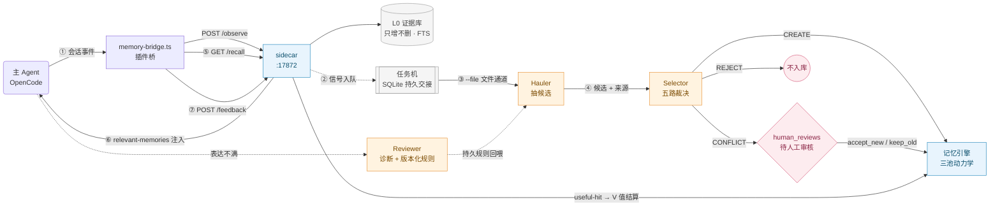
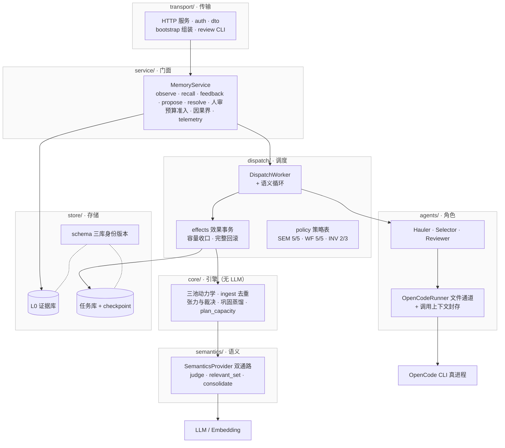
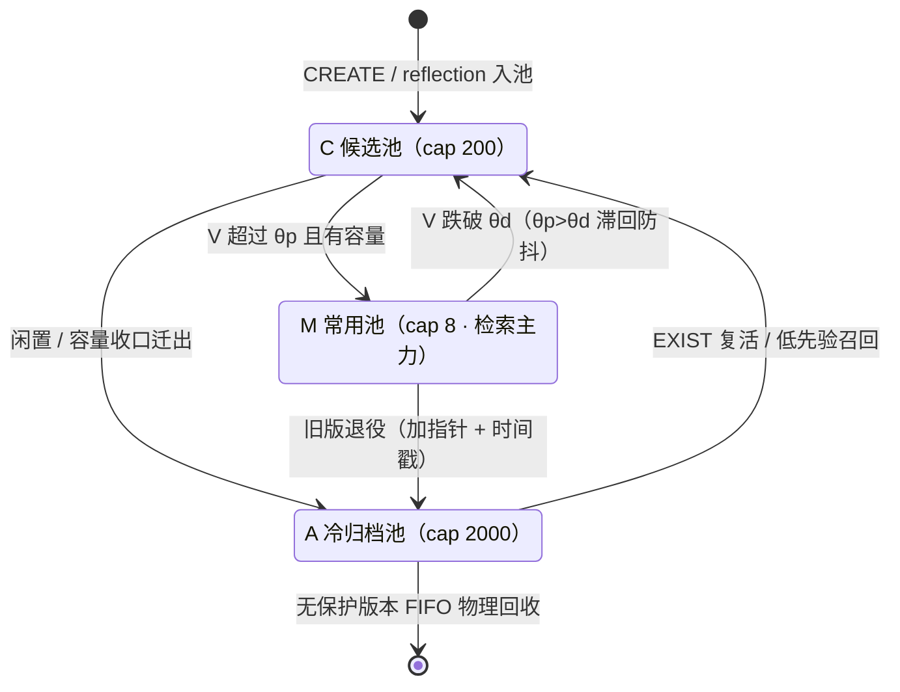
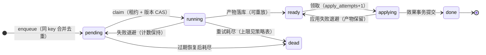
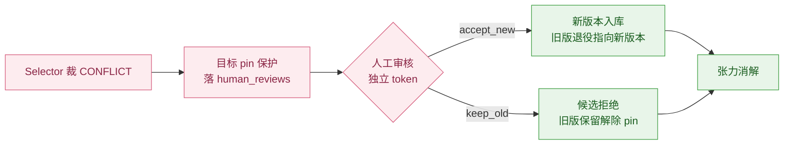

<div align="center">

# Dynamics-memory

> 状态：现行 · 收尾轮已完成（决策登记见 [analysis/target-architecture.md §9.3](analysis/target-architecture.md)）。
> 本页是行为摘要；机械验证入口在 [analysis/acceptance_check.py](analysis/acceptance_check.py)。

**LLM agent 的有界长期记忆层**

把连续、嘈杂、前后矛盾的项目交互，蒸馏成一个不会堆成"史山"的记忆库。<br/>
新会话里一句"接着搞"，agent 就知道进行到哪、上次卡在哪。


[全景](#全景一条对话的旅程) · [架构分层](#架构分层) · [记忆动力学](#记忆动力学) · [可靠性](#可靠性骨架) · [运行](#运行) · [配置](#配置)

</div>

---

## 30 秒上手

```bash
pip install numpy pytest
cp .env.example .env          # ZAI_API_KEY=...

python -m pytest tests/                          # 本地测试；不是远程验证
python -m hybrid_memory.server --project <dir>   # 或被 opencode 插件自动拉起
```

接入 opencode（官方 CLI 即可，无需源码）：

```bash
npm i -g opencode-ai
cd <本仓库> && opencode        # .opencode/plugin/memory-bridge.ts 自动加载并拉起 sidecar
```

<sub>给别的项目用：把 `memory-bridge.ts` 软链到 `<项目>/.opencode/plugin/`。插件的
`@opencode-ai/plugin` 依赖按软链的真实路径解析，所以要先在本仓库里跑一次 opencode
（或 `cd .opencode && npm i @opencode-ai/plugin`）让依赖装好。</sub>

## 为什么不用现成的两条路

| 路线 | 死因 |
|---|---|
| 全量 log 塞 context | 每轮付 O(log) 的 prefill+KV 扫描，随项目历史线性变贵 |
| 原文入向量库 | 冗余、过期、互相矛盾的副本堆成史山，旧状态压过新状态 |

**log 不是记忆，log 是证据。** 记忆是蒸馏产物，进池要过动力学与置信门控；
日志留在 L0 冷层，只在需要时按计量回展——永不整段进 prompt。

---

## 全景：一条对话的旅程

从主 agent 的一句"以后统一用 bun"，到它成为一条可检索、可归因、可结算的记忆：


```mermaid
flowchart LR
    U("主 Agent<br/>OpenCode") -->|"① 会话事件"| BR["memory-bridge.ts<br/>插件桥"]
    BR -->|"POST /observe"| SVC["sidecar<br/>:17872"]
    SVC --> L0[("L0 证据库<br/>只增不删 · FTS")]
    SVC -.->|"② 信号入队"| Q[["任务机<br/>SQLite 持久交接"]]
    Q -->|"③ --file 文件通道"| H["Hauler<br/>抽候选"]
    H -->|"④ 候选 + 来源"| S["Selector<br/>五路裁决"]
    U -.->|"表达不满"| REV["Reviewer<br/>诊断 + 版本化规则"]
    REV -.->|"持久规则回喂"| H
    S -->|"CREATE"| ENG["记忆引擎<br/>三池动力学"]
    S -->|"CONFLICT"| HR{"human_reviews<br/>待人工审核"}
    HR -->|"accept_new / keep_old"| ENG
    S -->|"REJECT"| X(("不入库"))
    BR -->|"⑤ GET /recall"| SVC
    SVC -->|"⑥ relevant-memories 注入"| U
    BR -->|"⑦ POST /feedback"| SVC
    SVC -->|"useful-hit → V 值结算"| ENG

    classDef agent fill:#FFF3E0,stroke:#E8963C,color:#7A4A00
    classDef core fill:#E8F4FD,stroke:#2B8CBF,color:#0B4F6C
    classDef store fill:#F5F5F5,stroke:#9E9E9E,color:#424242
    classDef risk fill:#FDECEF,stroke:#D65F7F,color:#8A2444
    class H,S,REV agent
    class ENG,SVC core
    class L0,Q store
    class HR,X risk
```

七步读法：① 每轮对话先落 L0（幂等回执，`request_id` 重放不重复入库）；
② 证据到位才发 `hauler_due` 任务；③ Hauler 在**真 OpenCode 进程**里跑，输入经
`--file` 私有附件传递、调用前封存上下文；④ 候选必须引用它见过的窗口内证据，
Selector 逐条裁决；⑤ 检索时相似度 + 压制 + 因果界过滤；⑥ 命中记忆按 token 预算
注入；⑦ 反馈经 recognizer 归因，只有**真被答案用上**的记忆拿到 useful-hit。

信号只负责持久交接、租约和幂等；三份 `.opencode/agent/*.md` 定义负责语义判断。
重叠滑窗按 L0 来源单元去重，冲突须人审。默认模式下主 agent
不能绕过 Selector 直接调用 `/propose` 或 `/resolve`。
完整协议、审核入口、恢复及已知边界见 [OpenCode 三 Agent 文档](docs/opencode-trio.md)。

旧的单轮 candgen 和 sidecar 内调查员仅在 `MEMORY_PIPELINE=legacy` 时使用；
其设计记录见[衔尾蛇说明](docs/ouroboros.md)，不能把旧记录当作默认模式的验证。

## 架构分层

依赖严格单向向下；模型调用与向量计算永远在服务锁外：


```mermaid
flowchart TB
    subgraph T["transport/ · 传输"]
        HTTP["HTTP 服务 · auth · dto<br/>bootstrap 组装 · review CLI"]
    end
    subgraph SV["service/ · 门面"]
        SVC["MemoryService<br/>observe · recall · feedback · propose · resolve · 人审<br/>预算准入 · 因果界 · telemetry"]
    end
    subgraph DP["dispatch/ · 调度"]
        W["DispatchWorker<br/>+ 语义循环"]
        EF["effects 效果事务<br/>容量收口 · 完整回滚"]
        POL["policy 策略表<br/>SEM 5/5 · WF 5/5 · INV 2/3"]
    end
    subgraph AG["agents/ · 角色"]
        TRIO["Hauler · Selector · Reviewer"]
        OCR["OpenCodeRunner 文件通道<br/>+ 调用上下文封存"]
    end
    subgraph SEM["semantics/ · 语义"]
        SP["SemanticsProvider 双通路<br/>judge · relevant_set · consolidate"]
    end
    subgraph CO["core/ · 引擎（无 LLM）"]
        ENG["三池动力学 · ingest 去重<br/>张力与裁决 · 巩固蒸馏 · plan_capacity"]
    end
    subgraph ST["store/ · 存储"]
        EDB[("L0 证据库")]
        TDB[("任务库 + checkpoint")]
        SCH["schema 三库身份版本"]
    end
    EXT["OpenCode CLI 真进程"]
    LLM["LLM / Embedding"]

    HTTP --> SVC
    SVC --> W
    W --> TRIO
    TRIO --> OCR --> EXT
    W --> EF
    EF --> ENG
    ENG --> SP --> LLM
    SVC --> EDB
    EF --> TDB
    SCH -.- EDB
    SCH -.- TDB

    classDef layer fill:#FAFAFA,stroke:#BDBDBD,color:#424242
    class T,SV,DP,AG,SEM,CO,ST layer
```

单进程内一条铁律：**锁内不做慢事**——模型、向量、文件 IO 全在锁外完成，
锁内只剩纯内存变更与事务提交（见 `prepare_effect` 的锁外预计算设计）。

## 记忆动力学

记忆 = 有版本的信念。每条携带 `src`（溯源到 L0 单元）与
`superseded_by / aggregated_into`（版本谱系），在三个池之间流动：


```mermaid
stateDiagram-v2
    direction TB
    [*] --> C: CREATE / reflection 入池
    state "C 候选池（cap 200）" as C
    state "M 常用池（cap 8 · 检索主力）" as M
    state "A 冷归档池（cap 2000）" as A

    C --> M: V 超过 θp 且有容量
    M --> C: V 跌破 θd（θp>θd 滞回防抖）
    C --> A: 闲置 / 容量收口迁出
    A --> C: EXIST 复活 / 低先验召回
    M --> A: 旧版退役（加指针 + 时间戳）
    A --> [*]: 无保护版本 FIFO 物理回收
```

| 机制 | 一句话 |
|---|---|
| 价值 × 置信分离 | `V ← V·e^(−λ) + η·hit + η_s·shadow`；高价值定半衰期，置信达标才服务——高价值低置信"活着但不用" |
| 滞回 + 驱逐 + 归档 | θp>θd 防抖，容量封顶，闲置进冷层——M 池有界且自我更新 |
| 压制即检测 | 过相似未入选对自动进 tension backlog，冲突检索时自然暴露 |
| 矛盾不静默 | 同实体矛盾聚合收编（全版本+时间戳），未决 conflict 不许自信出场（contested co-serve） |
| 容量背压 | 非退役版本总数超 `cap_context` 时按 FIFO 收口；全 pin 收不了口 → 503 拒收，绝不静默超限或解除保护 |
| 可溯源 | 每条记忆携带源单元 id，可回 L0 查证；`origin` 纯审计不给 V 加成 |

## 可靠性骨架

**一切变更走持久任务机**——崩溃后 kill -9 重启，已提交的证据不丢、租约过期的
任务重跑、快照落后以日志为准：


```mermaid
stateDiagram-v2
    direction LR
    [*] --> pending: enqueue（同 key 合并去重）
    pending --> running: claim（租约 + 版本 CAS）
    running --> ready: 产物落库（可重放）
    running --> pending: 失败退避（计数保持）
    ready --> applying: 领取（apply_attempts+1）
    applying --> done: 效果事务提交
    applying --> ready: 应用失败退避（产物保留）
    running --> dead: 重试耗尽（上限见策略表）
    pending --> dead: 过期恢复后耗尽
    done --> [*]
```

效果事务是唯一写入口：内存引擎变更、任务状态、checkpoint 与回执**同一笔
SQLite 事务**，失败深备份完整回滚。模型产物（ready 的 result）在应用失败时
保留退避，只有应用耗尽才 dead——绝不因收口失败清空合法产物重跑模型。

冲突裁决不删数据：CONFLICT 落 `human_reviews` 队列并 pin 保护目标，
人工持独立 token 二选一，其余待审自动标 stale——记忆不接受单方面改写。


```mermaid
flowchart LR
    S["Selector 裁 CONFLICT"] --> PIN["目标 pin 保护<br/>落 human_reviews"]
    PIN --> HUM{"人工审核<br/>独立 token"}
    HUM -->|"accept_new"| NEW["新版本入库<br/>旧版退役指向新版本"]
    HUM -->|"keep_old"| OLD["候选拒绝<br/>旧版保留解除 pin"]
    NEW --> T["张力消解"]
    OLD --> T

    classDef risk fill:#FDECEF,stroke:#D65F7F,color:#8A2444
    classDef ok fill:#E8F5E9,stroke:#43A047,color:#1B5E20
    class S,PIN,HUM risk
    class NEW,OLD,T ok
```

## 评测

评测平台 **TIDE** 与引擎完全分离（只经 HTTP 协议通信，真值不越过边界）。
设计见 [`docs/benchmark-design.md`](docs/benchmark-design.md)，
第一版可运行实现在 [`eval/`](eval/README.md)（场景驱动器 + 离线 mock + 基线报告）。

sidecar 为评测提供的两个能力：

| 参数 | 端点 | 作用 |
|---|---|---|
| `passive` | `GET /recall?passive=1` / `POST /search {"passive": true}` | 在引擎副本上检索：不改任何状态、不登记 retrieval_id（评测探针用） |
| `budget_tokens` | 同上 | 上下文按 `approx_tokens` 计数截断整行（CJK 单字 / ASCII 词 / 符号各记 1） |

<sub>旧的 experiments/ 评测已整体移除：其仿真与引擎共用真值对象、口径无法识别聚合输出、
样本量不足以支持结论，数字不再引用。</sub>

## 配置

| 环境变量 | 默认 | 作用 |
|---|---|---|
| `MEMORY_PIPELINE` | opencode | `legacy` 启用旧单轮 candgen 和进程内调查员；**其他值拒绝启动** |
| `MEMORY_AGENT` | on | `off` 暂停后台 agent，任务仍持久等待 |
| `MEMORY_AGENT_DAILY_CAP` | 200 | 仅 legacy 调查员的日调用上限 |
| `MEMORY_AGENT_MODEL` | glm-5.3-flash | 仅 legacy 调查员模型 |
| `MEMORY_OPENCODE_BIN` | opencode | OpenCode CLI 路径（需配置自己的模型 provider） |
| `MEMORY_BRIDGE_PORT` | 17872 | sidecar 端口 |
| `ZAI_API_KEY` | — | 原引擎向量编码等依赖；三 Agent 使用 OpenCode 自身 provider 配置 |
| `ZAI_BASE_URL` | `https://open.bigmodel.cn/api/paas/v4` | OpenAI 兼容端点（chat / embeddings），可换代理或本地 mock |

<sub>`MEMORY_PIPELINE=legacy` 下，旧调查员才在有 API key 时自动消费旧信号；
trio 队列、结果及 Reviewer 规则保存在 `tasks.sqlite`。</sub>

## 验证状态

Python 与 Bun 测试覆盖服务端、插件和 mock HTTP 不变量；手工 smoke 用真实 OpenCode CLI + 本地假模型完成三 Agent 任务交接；端到端穿透回归覆盖"observe→Hauler→Selector→效果落库→recall→feedback→信用结清"、"CONFLICT→人审双分支"与"kill -9 两库崩溃恢复"三条链。尚未验证真实模型语义质量或接入生产 provider，也未做 L3。`GET /health` 的 `validation` 固定为 `unverified`：进程在听，不等于已经验证。

`ok: true` 只表示没有 checkpoint fault，插件可以复用这个进程。它不表示快照干净，也不表示逐单元效果已经补齐。看 `snapshot` 和 `units_pending`。`snapshot=quarantined` 表示坏快照已被隔离成 `state.corrupt`，服务空启动，记忆没有从那份快照恢复。

## 运行

停机后再备份整个状态目录：`log.sqlite`、`tasks.sqlite`、它们的 WAL、`state.pkl`，以及同目录的 `bridge-outbox.json`。不要只回滚其中一个库。本批没有检测这种不配套，也不能靠旧副本找回备份之后的新数据。回滚要插件和 sidecar 一起回到旧版本。

坏的 `state.pkl` 会被隔离，服务仍会起来。这是为了不让桥瘫痪，不是数据还在。`state.corrupt` 留在目录里，启动声明不会把它说成合法空库。

<details>
<summary><b>目录结构</b></summary>

```text
hybrid_memory/
├── core/          引擎本体：types · engine · ingest · retrieval · dynamics ·
│                  consolidation · maintenance · signals（动力学全在锁内纯计算）
├── store/         三库与恢复：evidence(L0) · tasks(任务机) · schema(三库身份版本)
│                  · state(快照受限反序列化)
├── dispatch/      调度：worker(两路径) · effects(效果事务+容量收口) · policy(策略表)
├── agents/        三角色：hauler · selector · reviewer · payload(封存上下文)
│                  · opencode(文件通道) · protocol
├── semantics/     语义判断：real · llm · provider(SemanticsProvider 双通路+健康观测)
├── guards/        输入防线：provenance(溯源) · grounding(落地校验) · bounds
├── service/       MemoryService 门面：observe · recall · feedback · operate ·
│                  review · tools · budgets · lifecycle · telemetry · context
├── transport/     传输：http · auth · dto · bootstrap · review_cli
├── embed/         向量：cache(SQLite) · zhipu
├── legacy/        旧调查员回路（仅 MEMORY_PIPELINE=legacy）
├── config.py      Cfg / Settings / resolve_pipeline（未知值拒绝启动）
├── errors.py      错误域：Rejected / Degraded / Fatal + HTTP 码表
└── telemetry.py   健康与信号观测（地基层）
.opencode/         plugin/memory-bridge.ts · agent/{hauler,selector,reviewer}.md
analysis/          target-architecture.md（唯一设计）· architecture_contract.py（冻结契约）
                   · check_architecture.py · acceptance_check.py · docs/
docs/              opencode-trio.md · ouroboros.md · benchmark-design.md · architecture-inventory.md
eval/tide/         TIDE 评测（与引擎经 HTTP 分离）
tests/             pytest 回归：unit / integration / characterization / …
```
</details>

## OpenCode 三 Agent 协议

默认的 Hauler → Selector / 不满触发 Reviewer 协议、人工冲突审核、部署与恢复边界见 [docs/opencode-trio.md](docs/opencode-trio.md)。
