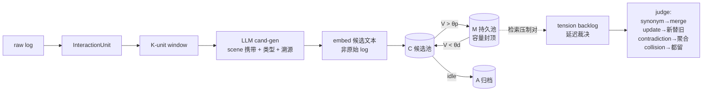

# Dynamics-memory

LLM agent 的有界自纠错长期记忆层——把连续、 noisy、前后矛盾的项目交互日志，
蒸馏成一个不会堆成"史山"的记忆库。

**Core idea**: raw logs are not memory. Logs feed an LLM candidate generator;
only distilled memory text is embedded and admitted — through a candidate pool —
into a bounded persistent pool governed by value dynamics (decay, reinforcement,
promotion, demotion, eviction) and explicit contradiction handling.

## 问题

agent 的 context 本身没有记忆。直接把交互 log 全量塞进向量库会迅速堆积成
冗余、过期、互相矛盾的"史山"：检索被重复副本淹没、旧信息压过新状态、
context 效率持续劣化。目标不是"记住所有细节"，而是维持**项目进度感与痛点**
的活性表征——新窗口里用户说一句"接着搞"，系统就知道进行到哪了。

## 架构


```mermaid
flowchart LR
    L[raw log] --> U[InteractionUnit]
    U --> W[K-unit window]
    W --> G[LLM cand-gen<br/>scene 携带 + 类型 + 溯源]
    G --> E[embed 候选文本<br/>非原始 log]
    E --> C[(C 候选池)]
    C -->|V &gt; θp| M[(M 持久池<br/>容量封顶)]
    M -->|V &lt; θd| C
    C -->|idle| A[(A 归档)]
    M -.检索压制对.-> T[tension backlog<br/>延迟裁决]
    T --> J[judge:<br/>synonym→merge<br/>update→新替旧<br/>contradiction→聚合<br/>collision→都留]
```

- **双池 + 值动力学**：`V ← V·e^(−λ) + η·hit + η_s·shadow`，晋升/降级滞回
  （θp > θd），容量驱逐，闲置归档——M 池有界且自我更新；
- **检索内压制即检测**：过相似未入选的对全部进 tension backlog，冲突在
  检索时自然暴露，不需要单独扫描；
- **矛盾处理**：同实体矛盾收编进**聚合 memory**（内含全部版本+时间戳，
  `pending_review` 等人工/LLM 终裁）；找得到作用域则条件化合并；
- **未决冲突不许自信出场**：入选记忆带未决 tension 时，对手版本随答案
  一并端给下游（contested co-serve）；
- **溯源**：每条记忆携带 `src` 源单元 id，检索级 evidence recall 可直接算。

## 衔尾蛇：agent 主动操作日志（pull 回路）

上面的流水线是推式的：日志 → 抽取 → 记忆，抽取器在窗口里没看出来的
东西永远丢了，而真实瓶颈恰恰在抽取/召回（参照要点进 top-5 的仅 ~18%）。
现在补上另一半——**记忆没接住的时候，agent 自己去翻日志，把查到的写回来**：

```mermaid
flowchart LR
    O[/observe] --> L0[(L0 LogStore<br/>SQLite+FTS5)]
    L0 --> S{触发扫描<br/>零 LLM}
    S -->|extract_due| Q[信号队列]
    R[/recall→feedback<br/>下一轮纠正 / 主 agent 用了 log_*] -->|recall_miss| Q
    Q --> W[AgentWorker<br/>预算·因果上界·日限额]
    W --> I[investigator<br/>opencode worker 角色]
    I -->|log_search / timeline / stats / window| L0
    I -->|/propose 校验后| E[(同一条 ingest 回路)]
    I -->|/diagnose miss_type| D[diagnoses.jsonl]
```

- **L0 先于一切**：每轮交互先落 `LogStore`（`.opencode/memory/log.sqlite`），
  再做被动蒸馏；candgen 失败不丢单元，转 `extract_due(candgen_failed)`。
- **信号，不是轮询**：`recall_miss`（下一轮开口纠正 / 主 agent 用了日志工具 /
  可选 recognizer NONE）与 `extract_due`（决策·数字·新实体·纠正·超长回复）。
  引擎只发信号，仍然一次 LLM 都不调。
- **工具面有闸**：`/log/*` 只返回片段与统计，原文只经 `log_window` 按字符
  预算回展；每次调查按 `X-Signal-Id` 计量工具次数与回展字符（超限 429），
  并施加 `before=t` 因果上界——调查员只能看到信号发生之前的日志。
- **嘴不是什么都吃**：`/propose` 逐条校验溯源存在且在因果上界内、脱敏、
  拒绝自指（"我检索了日志…"）、长度；`origin` 只是审计标签，不给 V 加成。
- **火墙**：调查员跑在 `MEMORY_BRIDGE_ROLE=worker` 的 opencode 会话里，
  插件只注册工具、不挂捕获钩子——它的会话永远不会被 observe。
- **被动 candgen 原样保留**：它是对照组。三臂评测（passive / passive+pull /
  raw-log-at-budget）赢不了"无差别读日志"，这个方向就不成立。

运行：`python -m hybrid_memory.server --project <dir>`（插件会自动拉起）；
`--no-agent` 或 `MEMORY_AGENT=off` 只跑被动路径；`GET /signals` 看队列、
预算、`miss_type` 分布与调查员状态。设计与取舍见 `docs/ouroboros.md`。

## 目录

```text
hybrid_memory/    包本体：core（引擎）/ logstore（L0）/ triggers / agent（调查员）/ candgen / embed / semantics / sim / datasets
.opencode/        opencode 集成：plugin/memory-bridge.ts（main/worker 两角色）+ agent/*.md（judge/recognizer/candgen/consolidator/investigator）
experiments/      驱动脚本 + paths.py（产物目录常量）+ out/（cache/candgen/runs/qa/bench/tmp）
docs/             设计文档（ouroboros.md：pull 回路）
data/             输入（原始日志与大体积 benchmark 不入库，见 .gitignore）
tests/            pytest
```

## 评测（因果约束回放）

t 时刻的提问只能用 t 之前流入的记忆回答——无前窥。在真实 6 周项目日志
（106 个交互单元）上：

| 评测 | 结果 |
|---|---|
| 续话感（真实后续提问，1-5 分） | **memory 3.00** / flat-log 2.39 / none 2.23；≥4 分率 38% vs 8% |
| 原始日志出题 QA（36 题） | acc **0.667**，拒答 3/3 全对 |
| LoCoMo（跨分布对照） | 0.29——暴露了蒸馏丢细节与"单次问答"协议错位 |

已知边界（诚实口径）：n 小的方向性证据而非决定性证据；semantic judge
默认 verbatim 规则，`--llm-judge` 启用 LLM 裁判链（tension 裁决 +
recognizer + consolidation 回调，`--feedback` 依赖它）；archive 池尚无界。

## 机制证据分级

`Cfg` 默认全部关闭可选机制（`confidence_on / salience_on / novelty_on /
consolidation_on` 均 False、`lex_weight=0`），`--feature-set` 逐层开启。
机制与记忆同一套规则：拿不出评测证据的不进默认路径。

| 机制 | 13 点消融证据 | 处置 |
|---|---|---|
| salience 半衰期 | ≥4 率 +15pp，归档 108→69（高价值延寿生效） | 唯一独立正贡献 |
| confidence 置信门 | 单开 −0.077，配合 salience 后回正；33 条被压服务线 | 保留，默认关 |
| novelty 初始加成 | 与不开逐题完全相同 | 默认关 |
| consolidation/reflection | 8 次触发、7 条上桌，分数无效应 | 默认关 |
| lex 词法召回 | 离线重排：修半题砸一题 | 默认关 |

当前真实瓶颈在抽取/召回而非动力学：参照要点进 top-5 上下文的仅 ~18%
（池级覆盖亦不足），reader 忠实甚至超产。

## 复现

```bash
pip install numpy pytest
cp .env.example .env   # ZAI_API_KEY=...
python -m pytest tests                              # 机制单测
python -m experiments.candgen_real                  # 窗口 → 候选（LLM）
python -m experiments.run_real --allow-remote       # 因果回放
python -m experiments.qa_real --allow-remote        # 原始日志出题 QA
python -m experiments.qa_continuity --allow-remote  # 续话感三组对照
python -m experiments.run_bench --dataset locomo --limit 1
```
