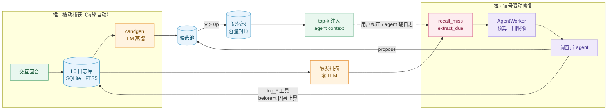
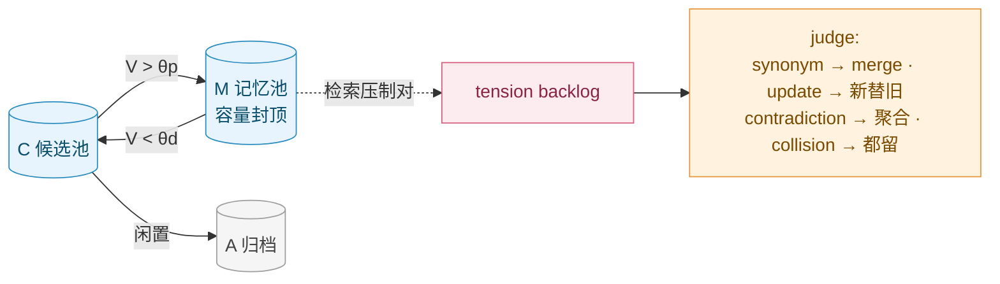
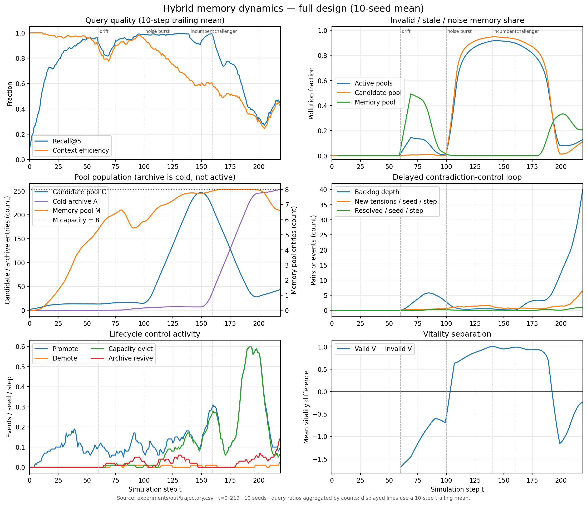

<div align="center">

# Dynamics-memory

**LLM agent 的有界长期记忆层**

把连续、嘈杂、前后矛盾的项目交互，蒸馏成一个不会堆成"史山"的记忆库。<br/>
新会话里一句"接着搞"，agent 就知道进行到哪、上次卡在哪。


[架构](#架构推式捕获--拉式修复) · [动力学](#记忆动力学) · [验证状态](#验证状态) · [运行](#运行) · [设计文档](docs/ouroboros.md)

</div>

---

## 30 秒上手

```bash
pip install numpy pytest
cp .env.example .env          # ZAI_API_KEY=...

python -m pytest tests/                          # 212 passed
python -m hybrid_memory.server --project <dir>   # 或被 opencode 插件自动拉起
```

接入 opencode（官方 CLI 即可，无需源码）：

```bash
npm i -g opencode-ai
cd <本仓库> && opencode        # .opencode/plugin/memory-bridge.ts 自动加载并拉起 sidecar
```

<sub>给别的项目用：把 `memory-bridge.ts` 软链到 `<项目>/.opencode/plugin/`。插件的
`@opencode-ai/plugin` 依赖按软链的真实路径解析，所以要先在本仓库里跑一次 opencode
（或 `cd .opencode && npm i @opencode-ai/plugin`）让依赖装好。</sub>

```text
交互回合 ──observe──→ L0 日志 + candgen 蒸馏 → 记忆池
问答     ──search───→ top-k 记忆注入（<relevant-memories> 块）
miss    ──信号──────→ 后台调查员翻日志 → propose 写回
```

## 为什么不用现成的两条路

| 路线 | 死因 |
|---|---|
| 全量 log 塞 context | 每轮付 O(log) 的 prefill+KV 扫描，随项目历史线性变贵 |
| 原文入向量库 | 冗余、过期、互相矛盾的副本堆成史山，旧状态压过新状态 |

**log 不是记忆，log 是证据。** 记忆是蒸馏产物，进池要过动力学与置信门控；
日志留在 L0 冷层，只在需要时按计量回展——永不整段进 prompt。

## 架构：推式捕获 + 拉式修复


```mermaid
flowchart LR
    subgraph PUSH["推 · 被动捕获（每轮自动）"]
        direction TB
        U["交互回合"] --> L0[("L0 日志库<br/>SQLite · FTS5")]
        L0 --> CG["candgen<br/>LLM 蒸馏"]
    end

    CG --> CP[("候选池")]
    CP -->|"V &gt; θp"| MP[("记忆池<br/>容量封顶")]
    MP --> INJ["top-k 注入<br/>agent context"]

    subgraph PULL["拉 · 信号驱动修复"]
        direction TB
        SIG["recall_miss<br/>extract_due"] --> AW["AgentWorker<br/>预算 · 日限额"]
        AW --> INV["调查员 agent"]
    end

    INV -->|"log_* 工具<br/>before=t 因果上界"| L0
    INV -->|"propose"| CP
    INJ -. "用户纠正 / agent 翻日志" .-> SIG
    L0 --> TR["触发扫描<br/>零 LLM"] --> SIG

    classDef store fill:#E8F4FD,stroke:#2B8CBF,color:#0B4F6C
    classDef llm fill:#FFF3E0,stroke:#E8963C,color:#7A4A00
    classDef signal fill:#FDECEF,stroke:#D65F7F,color:#8A2444
    classDef agent fill:#EFE9FB,stroke:#8B6FDB,color:#4A3791
    classDef io fill:#E9F7EF,stroke:#3E9B6A,color:#1E5E3C
    class L0,CP,MP store
    class CG,TR llm
    class SIG signal
    class AW,INV agent
    class U,INJ io
```

两条回路共享同一个 L0 与 ingest 通道：

- **推·保覆盖**——每轮先落 L0 再蒸馏，不靠 agent 自觉；candgen 失败不丢
  单元，转 `extract_due` 交修复回路
- **拉·补漏**——`recall_miss`（用户纠正 / agent 用了 log_*）与 `extract_due`
  （决策·数字·新实体触发）驱动后台调查员翻日志、核实、`/propose` 写回——
  **走同一条 ingest，无任何特权**
- **闸在服务端**——log_* 只给片段与统计，原文按字符预算回展；
  按信号计量工具调用（超限拒绝）；`before=t` 因果上界物理上锁死未来
- **火墙**——调查员是 sidecar 进程内的 function-calling 循环
  （`agent/inline.py`），只有 6 个只读工具，不经过 opencode、不调 observe，
  它的工作天然不会被记成记忆；写入只走最终 JSON → 服务端校验

## 记忆动力学


```mermaid
flowchart LR
    C[("C 候选池")] -->|"V &gt; θp"| M[("M 记忆池<br/>容量封顶")]
    M -->|"V &lt; θd"| C
    C -->|"闲置"| A[("A 归档")]
    M -. "检索压制对" .-> T["tension backlog"]
    T --> J["judge:<br/>synonym → merge · update → 新替旧<br/>contradiction → 聚合 · collision → 都留"]

    classDef pool fill:#E8F4FD,stroke:#2B8CBF,color:#0B4F6C
    classDef cold fill:#F5F5F5,stroke:#9E9E9E,color:#424242
    classDef hot fill:#FDECEF,stroke:#D65F7F,color:#8A2444
    classDef judge fill:#FFF3E0,stroke:#E8963C,color:#7A4A00
    class C,M pool
    class A cold
    class T hot
    class J judge
```

| 机制 | 一句话 |
|---|---|
| 价值 × 置信分离 | `V ← V·e^(−λ) + η·hit + η_s·shadow`；高价值定半衰期，置信达标才服务——高价值低置信"活着但不用" |
| 滞回 + 驱逐 + 归档 | θp>θd 防抖，容量封顶，闲置进冷层——M 池有界且自我更新 |
| 压制即检测 | 过相似未入选对自动进 tension backlog，冲突检索时自然暴露 |
| 矛盾不静默 | 同实体矛盾聚合收编（全版本+时间戳），未决 conflict 不许自信出场（contested co-serve） |
| 可溯源 | 每条记忆携带源单元 id，可回 L0 查证；`origin` 纯审计不给 V 加成 |

## 验证状态

**机制层被测过，端到端还没活过。**



<sub>10 种子均值的仿真：M 池贴着容量封顶走（有界性）、噪声暴下污染被压制在
候选池而不进记忆池（门控生效）、有效与失效记忆的 vitality 明确分离。</sub>

| 已验证 | 未验证 |
|---|---|
| `pytest` 212 通过 | 调查员接真 API 端到端真跑 |
| 因果回放评测（106 单元真实日志） | 真实会话的 miss 分布与记忆质量 |
| 三臂对照：memory / flat / none | 有害命中率（旧事实推翻后不再注入） |

因果回放：t 时刻的提问只能用 t 之前流入的记忆，无前窥。

| 评测 | 结果 |
|---|---|
| 续话感（1-5 分） | **memory 3.00** / flat 2.39 / none 2.23；≥4 分率 38% vs 8% |
| 原始日志 QA（36 题） | acc **0.667**，拒答 3/3 全对 |
| LoCoMo（跨分布对照） | 0.29——暴露蒸馏丢细节与协议错位 |

<sub>已知边界：n 小的方向性证据而非决定性证据；judge 默认 verbatim
规则（`--llm-judge` 启用 LLM 裁判链）；archive 池尚无界。</sub>

## 机制证据分级

`Cfg` 默认关掉所有可选机制，`--feature-set` 逐层开启——
**拿不出评测证据的不进默认路径**。

| 机制 | 13 点消融证据 | 处置 |
|---|---|---|
| salience 半衰期 | ≥4 率 +15pp，归档 108→69 | 唯一独立正贡献 |
| confidence 置信门 | 单开 −0.077，配 salience 后回正 | 保留，默认关 |
| novelty / consolidation / lex | 分数无效应或互有胜负 | 默认关 |

<sub>真实瓶颈在抽取/召回：参照要点进 top-5 仅 ~18%——pull 回路为此而建。</sub>

## 配置

| 环境变量 | 默认 | 作用 |
|---|---|---|
| `MEMORY_AGENT` | on | `off` 只跑被动链路 |
| `MEMORY_AGENT_DAILY_CAP` | 200 | 调查员日调用上限 |
| `MEMORY_AGENT_MODEL` | glm-5.3-flash | 调查员模型（旧 `provider/model` 写法兼容） |
| `MEMORY_BRIDGE_PORT` | 17872 | sidecar 端口 |
| `ZAI_API_KEY` | — | LLM 凭证（candgen / judge / recognizer / 调查员） |
| `ZAI_BASE_URL` | `https://open.bigmodel.cn/api/paas/v4` | OpenAI 兼容端点（chat / embeddings），可换代理或本地 mock |

<sub>调查员默认启用：有 API key 就自动消费信号（不依赖 opencode）。
`GET /signals` 看队列、预算用量与 miss_type 分布；诊断落 `diagnoses.jsonl`。</sub>

<details>
<summary><b>目录结构</b></summary>

```text
hybrid_memory/
  core/          引擎：types / engine / ingest / retrieval / maintenance / signals
  logstore.py    L0 日志层：SQLite + FTS5 + mentions 倒排 + 可选向量 RRF
  triggers.py    确定性触发扫描（零 LLM）
  worker.py      judge / recognizer / consolidator 两阶段锁调度
  agent/         调查员：investigator（契约）/ inline（进程内工具循环）/ loop（AgentWorker）
                 / opencode（OpencodeRunner，实验用 --opencode 壳）
  candgen/       被动蒸馏器
  server.py      sidecar HTTP 面
.opencode/       plugin/memory-bridge.ts（主 agent 桥）+ agent/*.md（实验用 judge 等壳）
experiments/     评测驱动脚本 + out/ 产物
docs/            ouroboros.md（pull 回路设计与取舍）+ opencode-learning/（opencode 源码学习笔记）
tests/           pytest，212 项
```
</details>

<details>
<summary><b>复现评测</b></summary>

```bash
python -m experiments.candgen_real                  # 窗口 → 候选（LLM）
python -m experiments.run_real --allow-remote       # 因果回放
python -m experiments.qa_continuity --allow-remote  # 续话感三臂
python -m experiments.run_bench --dataset locomo    # 跨分布对照
```
</details>
