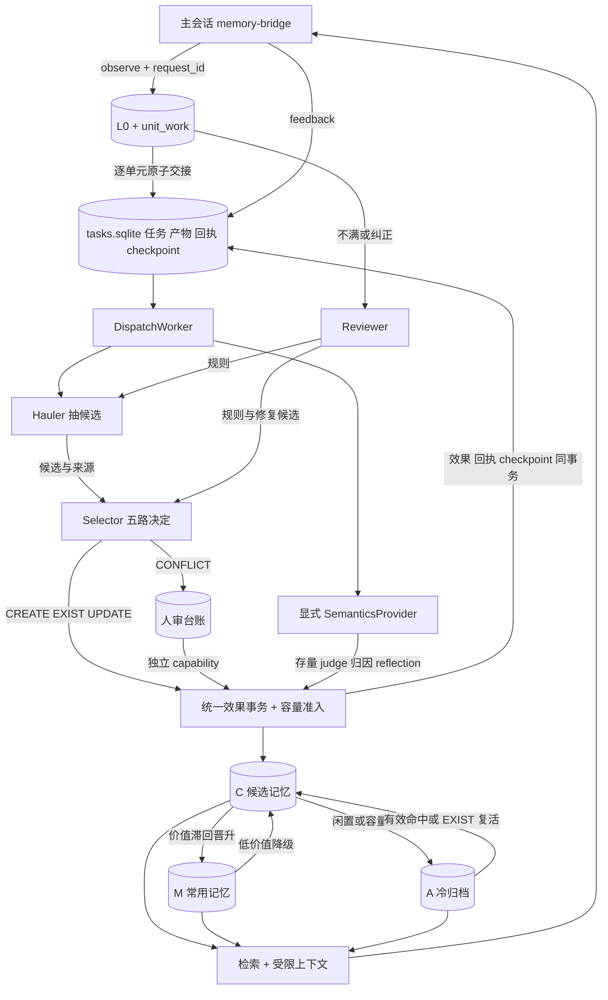
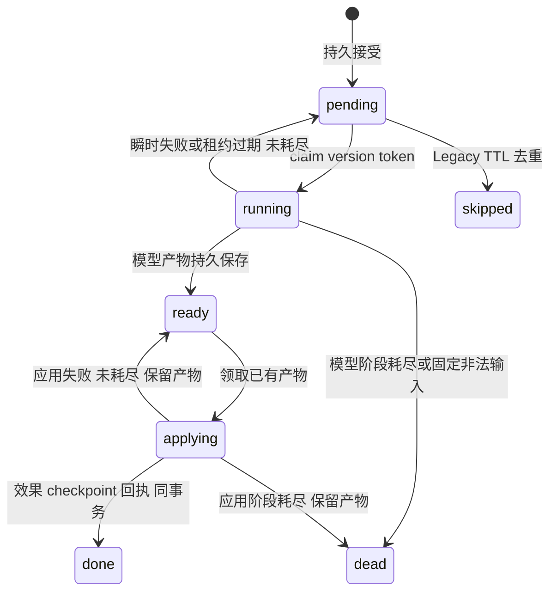
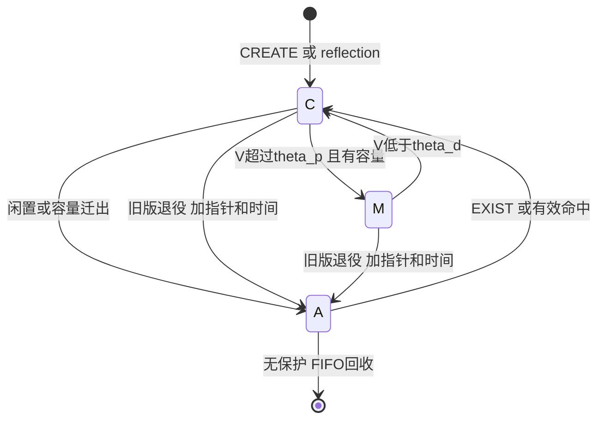

# 唯一目标架构：信号、三 Agent、三池

> 合并版，2026-10-03；代码基线 `db26787`（P6 `1552112` + 本地测试隔离修复）。
> 本文取代原目标架构及本轮临时 `ARCHITECTURE.md`，只保留这一个规范入口。N01–N28 是本轮委托的明确设计决策；它们修订旧 H 决议的对应条款，不代表运行代码已经实现。
> [源符号附录](../docs/architecture-inventory.md) 属于本文：逐项登记每个自有模块、类、函数、私有/嵌套 helper 的功能、输入、输出、作用、错误、目标路径、处置与变更条件；固定契约数据在 [`architecture_contract.py`](architecture_contract.py)。附录是本文的逐符号白名单：源码里出现但未登记的符号=覆盖检查失败；未登记的函数/模块在统一删除前必须先登记或列入删除项，不能静默消失。产品代码的模块级常量/别名同样在 `architecture_contract.py::CONSTANTS` 逐条登记，未登记即红（测试/评测常量随所属模块，TIDE 内冻结）。
> 旧决策依据：[H1–H42](decision-register.md)；验收：[A1–A10](acceptance-criteria.md)。`mvp/agent/` 全部排除，`hybrid_memory/agent/` 是自有兼容层，不能混淆。

## 0. 文档与清理边界

- **当前**为基线真实行为；**目标/待实现**为下一轮实施契约，不拿目标证明闭环已通。
- 处置只有保留、接线、迁移、兼容保留、历史归档、删除、迁移后删除。没有“P6 后再说”的无归属函数。
- 不为了目录树美观创造第二套包装 API。逻辑已在合理位置就修文档；确实缺功能才补实现。
- 源符号附录包含全部自有 Python 源文件、显式函数和类，包括测试、评测、验收及 nested helper；每个符号给出功能/输入/输出/作用/错误/目标（目标路径、处置、变更条件）。TS 可调用入口在第 7 节。匿名 lambda、映射回调、字符串嵌入的测试子进程程序归父函数，隐式 dataclass/Enum 方法归类型契约。
- 公开产品符号的目标契约（含结构化返回字段）在 `architecture_contract.py` 逐条固定；私有 helper 与测试符号由模块契约+语法签名合成，仍必须完整给出上述字段。计划新增与删除项同样在该文件冻结，见 §5.9 与 §9。产品代码的模块级常量/别名在 `CONSTANTS` 表逐条登记（判定范围＝顶层 Assign/AnnAssign 且全大写或 `_` 开头，dunder 除外），检查器强制未登记即红。
- 后续清理只执行第 9 节的明确处置。漏登是覆盖检查失败，不是自动删除授权；调用方、状态/部署兼容和替代测试迁完才删。数据目录、证据、凭据、Git 历史、第三方源码未获删除授权。
- 测试和 TIDE 是验收资产，不能按“生产没 import”判断死代码。本文与附录不得各自保存不同的目标策略；附录只自动记录现状形态，行为决策只在本文。

## 1. 公理、闭环与目录

### 1.1 七条公理的准确范围

1. 证据不是记忆：L0 不可覆盖、Memory 携带 src；模型只得到受限证据视图。
2. 记忆是动力系统：pool、V、confidence、pending_review、retirement 正交；池不是真假标签。
3. 抽取是协议：载荷封存→语义判断→严格校验→事务效果；Agent 不直接改数据库。
4. 效果原子且幂等：同任务/操作键至多一次，恢复成功后才算义务兑现；模型调用可能多次，dead 不叫成功。
5. 活跃资源有界：C/M/A、非退役上下文、在途任务、人审、规则、窗口、检索登记有上限；历史 L0/审计只告警、不自动删，不能宣传总磁盘严格有界。
6. 不静默失败：拒收、降级、启动失败、未知故障分开；NONE/pending 不冒充传输成功。
7. 单项目单有效写者：服务锁保护内存，SQLite lease/version/CAS 保护提交；无分布式假设。

### 1.2 目录责任与依赖图

- `hybrid_memory/core/`：领域类型、检索、信用、张力、三池与确定性触发。禁止直接 SQLite/HTTP/subprocess/语义模型；当前注入 embedder 仍可能访问网络，不能把“不调 LLM”写成“完全无 I/O”。目标服务预计算向量后再持锁应用，裸引擎兼容调用保留。
- `store/`：证据、任务与快照存储；只依赖 core/errors 与标准库，不反向 import service/dispatch。policy 数据显式传入；TaskLeaseLost 底层类型归 errors，旧位置兼容导出。
- `guards/`：纯格式、范围、来源、正文、脱敏校验；联接证据的 I/O 归 service。
- `agents/`：载荷、严格协议校验和 CLI 运行器；不执行 SQL、不修改 Memory。目标 validate 输入封存上下文，不把可变 service 当权限对象。
- `dispatch/`：sidecar 唯一 Task 调度和效果编排；角色只是 runner/applier。unit_work 顺序恢复仍是独立证据交接，不是第二模型任务机。
- `service/`：单项目门面、RLock、observe/recall/feedback、预算、人审、生命周期；不 import transport。
- `transport/`：HTTP、DTO、鉴权、人审 CLI。除唯一组合根 bootstrap 外只调 service，不直接改领域对象。
- `embed/`、`semantics/`、未来 `llm/client.py`：模型适配与缓存，不持有事实写权。
- `legacy/`：显式旧管线与裸引擎语义消费者；default Trio 不从这里取得公共类型/校验。
- `.opencode/agent/{hauler,selector,reviewer}.md`：权限/输出协议；`.opencode/plugin/memory-bridge.ts`：主会话捕获、注入、outbox。
- `analysis/`：本文、历史 H、验收和覆盖工具；`docs/`：协议与历史证据。取消另建根 ARCHITECTURE/docs/architecture 或每 H 一页 ADR 的重复规范。
- `tests/`：unit/integration/protocol/characterization 与共有 fakes；`eval/tide/` 冻结判分，`eval/*.py` 迁 harness，`eval/checks/` 历史归档。

全部现存文件、空 `__init__`、导出 shim 都在附录登记。确切目标迁移：`logstore.py→store/evidence.py`；`llm.py→llm/client.py`，缓存 helper 留 client；新增 `semantics/provider.py`，保留 real/llm 内部 prompt。不新增 TensionBook、stub/prompts/cache 空包装，也不再次拆一套动力学算法。

部署契约保留：`python -m hybrid_memory.server`；包导出 `Cfg/Settings/MemoryService/build_default_service`；人审 CLI 为 `python -m hybrid_memory.transport.review_cli`，旧 human_review 导入/命令留 shim。版本号待包元数据真实提供，不伪造已有版本。

## 2. 信号与派发

### 2.1 业务信号、任务与同步原语（N02）

- `Signal(kind,payload,t,key,id)` 是干活理由，不是权限或事实。
- Task 是 SQLite 接受义务：版本、状态、尝试次数、产物、lease/token、退避、回执与 checkpoint。
- `RLock/Lock/Event` 是同步：代码没有 threading.Semaphore。Event 仅唤醒、允许合并，DB 决定有没有活；lease 不能替代内存锁。

SignalQueue.emit 先 on_emit；返回非 None 即该回调接管。observe 内 -1 只表示当前事务已收集，不表示 DB 已 commit。异常必须回滚内存标志、游标、计数和候选。裸 engine 的易失 queue(cap=256) 可以丢最旧并计 n_dropped；sidecar 工作信号必须同效果持久交接，仅 thin_recall 可易失。不得把已接受 Task 放回会丢的内存队列。

### 2.2 每个 kind 的完整接力（N03）

- `hauler_due`：observe 原子交接；入 `{unit_id}`，key=`hauler:{uid}`；Hauler 输出候选，effect 建 selector_due；空批完成但不建空任务。Trio only。
- `selector_due`：Hauler/Reviewer effect 生产；入 `{unit_id,candidates,parent_task}`，key=`selector_due:{parent}`；Selector 出五路决定，apply_selector 整批原子执行。领取后候选不可改绑。
- `reviewer_due`：不满/纠正调度；入 `{unit_id}`，key=`reviewer:{uid}`；Reviewer 出诊断、规则、修复、规则评审；修复仍过 Selector。
- `conflict_pending`：老化 tension/shadow 需求；入 id-pair 列表，key=`conflict`，有序去重并集；SemanticsProvider.judge 输出关系与 Memory/张力邮戳；人审冻结优先于自动裁决。
- `feedback_pending`：回答后 feedback；入 `{retrieval_id,selected,texts,question,answer}` 实际展示快照；归因输出 used bool 列表/recog_fail；effect 只结信用、不改正文。
- `maintenance_due`：scene 巩固触发；入 `{scene,ids}`，key=`maint:{scene}`，未领时取最新；consolidate 出 reflection Event 或明确 NONE；不退役来源。
- `recall_miss`：Legacy 工具痕迹/纠正/明确 miss；入问题、来源、线索、已召回、first_t；规范问题 key；Legacy 调查员处理。Trio `/miss` 必须拒绝，不造无人消费任务。
- `extract_due`：Legacy scan/candgen 失败；入 `{unit_id,scene,reasons,entities}`，key=`unit:{uid}`，原因/实体并集；Legacy 调查员。
- `thin_recall`：不足 k，仅 `{q,n_selected}` 有界统计；不默认触发 LLM 或补抽。
- `feedback/capture/unit_receipts/operations` 是回执，不是 Task kind；不靠混进 POLICIES 凑注册数。

启动自检检查 active pipeline 的 producer、policy、runner、callable applier 四者一致及反向野项；receipt 明确豁免。暂停领取不等于消费者不存在；未知 kind/dispatch 空 apply 是 Fatal。当前 assert_consumers 只查 key、Legacy 注册仅有 owner、Trio /miss 仍造孤儿，均待实现。

### 2.3 单状态机与两库义务（N04）

- accepted=true 证明输入/Task 已持久，不证明已写 Memory，更不证明正确。
- 同 Task/op_key 效果至多一次，恢复完成才兑现；模型不保证一次。dead 保留未兑现义务和原因，不自称成功。
- L0+unit_work+请求绑定在 log.sqlite 先接受；效果+下游 Task+unit_receipt+checkpoint 在 tasks.sqlite 原子；最后确认 unit_work。两库中间崩溃凭回执补确认，不伪造跨库事务。
- `(kind,key)` 只合 pending 且 attempts=0；领取冻结 payload/version/before。done 后同 key 是否跳过只由明确 Legacy TTL 决定。
- request_id 正文 sha256 绑定：相同重放旧回执、异正文409，不换 id 偷执行；operation 签名与 task key 语义保留。
- checkpoint revision CAS 识别旧写者；提交结果不确定设 fault，只能恢复最新权威状态，不用回滚内存覆盖已提交数据库。

### 2.4 调度、重试、成本与停止（N05–N07）

1. DispatchWorker 统一 active Task 驱动；run_semantic_tasks/Legacy.process_once 先作无独立线程 adapter，迁完重复循环。unit_work 按 uid 严格顺序；模型任务不要求全局 FIFO。
2. SQL 先筛 next_run_at<=now 再 LIMIT，默认每轮8项；ready产物优先，语义/工作流/调查类别轮转、类别内id升序，空名额借用。不先取未来8项把第9个已到期项饿住。
3. 默认 sidecar 后台模型任务并发1；锁外执行模型与 embedding 准备，锁内只复核/应用。先求正确交付，不新增任务并行。
4. WF/SEM 模型上限5、应用上限5；INV兼容2/3。过期领取也计次数；ready复用不问模型。合法产物因容量/CAS/临时I/O应用失败保留，不能清空重问。
5. 传输/超时/解析按 `min(300,2^min(8,attempts))` 退避；固定非法来源/超证据窗可直接dead。取消无限SEM requeue，耗尽dead等待人工重发并保旧关联。不能用所有 ValueError 代表同一种失败。
6. policy 增 max_apply_attempts，limits/lease/backoff唯一解析。WF lease600s、runner timeout300s；SEM lease覆盖一次完整client超时+内部重试预算+60s，不用120s套长请求。
7. sidecar 新模型逻辑调用共用持久日额度200（可配），按 run/judge/relevant_set/consolidate 预扣；ready不扣。OpenCode内部请求/token账单不可从逻辑额度精确推断，主会话调用不归本侧。
8. no_agent 暂停Task调度的模型调用/领取，不停L0接受、回执补确认、查询；embedding仍可访问网络。显式Legacy为兼容仍运行被动candgen（包括unit恢复）；所以此开关不叫“完全无模型模式”。health分别报告capture/dispatch/semantics。
9. Stop停止领取并唤醒，等待或取消在途到有界deadline，产物可存则ready；确认线程停止后save/close。join(5)未停不能声称安全关闭。lost wake由DB扫描恢复。

### 2.5 锁序与唯一效果入口（N08）

锁序：unit/dispatch busy → service RLock → 单个store锁/事务。Store callback不得反取service锁；不能同时持log与tasks写事务。lease决定谁可提交，RLock决定内存串行。

目标 `effect_transaction(svc,mutate,*,capture=None,task=None,unit=None)`：三种回执上下文互斥，mutate形状`(conn)->dict`；统一内存备份、信号收集、容量复核、checkpoint CAS、操作回执/done与回滚。不同Store原语保留，但产品只能经此编排。模型/向量准备在事务外，入事务复核源锚、目标邮戳、lease/revision；漂移明确stale/重判，不沿旧id套新对象。

目标新增 `prepare_effect(svc,row)->plan`：封存产物/来源→已验证Event、预计算vectors、目标版本、预期revision与动作计划。embedding失败没有内存效果；计划入事务后复核。`run_ingest/MemoryEngine.propose`目标可选`vectors=`，`admit_reflection/add_reflection`可选`vector=`；裸调用None维持兼容，sidecar事务必须供给预计算值，不用临时替换全局embedder。

_rollback_effect保护对象身份保留；提交后确认丢失设fault不续写。当前complete/apply_unit/apply_operation、人审手写事务及多份collect是迁移项，不能删合法receipt/token复核来凑“单入口”。

## 3. 三 Agent 协议与可操作行为

### 3.1 权限边界（N09）

三角色当前permission为`'*':deny`，目标保持无bash/read/edit/glob/webfetch/task。只处理封存JSON，`--pure`和内部session env防捕获自身。可操作行为不是任意工具调用：Hauler推荐candidate、Selector推荐action、Reviewer推荐rule/repair/assessment；服务校验并执行。不给bearer/human capability，不绕Legacy直写端点。

主会话有六项：memory_search、memory_conflicts、log_search、log_timeline、log_stats、log_window。“只读”指不写事实正文；普通search仍登记rid/信用/张力，不等于passive。人审CLI不是第四个自主Agent。

### 3.2 封存调用上下文（N10）

调用前持久call_context：task/version、source anchor/before、实际window ids、源正文hash、memory snapshot revision/ids/邮戳、实际rules id/正文、协议版本。校验对应原输入，不能重新生成payload批准旧输出。

- Hauler/Reviewer来源在实际六单元窗且t<anchor.t+1；不得自行扩大历史。
- Selector快照是决策时当前状态，不冒充历史；target必须在已给快照。入事务被前序决定退役则全批回滚。
- Reviewer handoffs只承认投诉派发前提交；后来完成标pending_at_complaint。缺prior retrieval为unknown，不能证明成功/失败。
- Reviewer必须获得已观测Hauler/Selector rule_ids对应的不可变instruction/scope/version、实际uses及启停状态；不能查target='reviewer'得到空规则后要求它评价不曾看到的指导。

### 3.3 Hauler

入`{kind,task_id,unit_id,window:[{unit_id,t,scene,user_text,assistant_text,truncated}],rules:[{id,target,scope,instruction}]}`；出`{candidates:[{text,source_unit_ids,entity_key?,salience?}]}`，0–50项、最终单条≤1200字符。空批合法。

按类型→供给来源/因果→脱敏/自指/浅正文接地校验，text+src规范去重。新协议ID严格int排bool/float，不沿旧缓存parse宽容策略。区分用户采纳与助手建议；重复窗口不算独立证据。Hauler不判CREATE/UPDATE，不声称入池。浅接地只证明片段一致，不能证明语义蕴含或事实为真。

### 3.4 Selector五路（N11–N12）

入候选、完整未退役C/M/A快照（含id/text/src/entity/birth/pool/邮戳）、rules、call_context。出`{decisions:[{candidate_index,action,target_id?,verified_correction?,reason?}]}`；每候选恰一，index严格int并覆盖全范围。

- CREATE：服务仍执行精确规范重复兜底/ingest，默认新C，不直接M，无origin价值加成；等价精确项改EXIST并记录实际target。
- EXIST：同义同scope未退役目标，A合法；src集合只按新unit增evid，更新last_seen，A→C。confidence开启时仅新证据增conf_pos；不能重复窗口刷置信。
- UPDATE：必须`verified_correction is True`，引用明确用户纠正，目标不晚于纠正锚且不在人审冻结中。entity/scope明确一致；未知归属或跨实体转CONFLICT。新版本C，旧版指向新代表并A+archived_at；最新不等于正确。当前bool('false')漏洞待修。
- CONFLICT：保存candidate/target版本/原因/source task到人审，冻结旧target、召回警告；candidate尚无Memory id，不是假C，不pin虚构id。unknown/retired target要stale/重判，不是合法审批对象。
- REJECT：不入Memory，但L0与Task输出、原因、回执保留。

validate出规范Decision计划（校验Event/实际action/target stamp），applier只动态复核/修改，不重复整套静态校验。batch全有或全无。

快照≤500完整或失败，不截断猜CREATE；设cap_context=500保证准入与完整上下文一致，不静默把A藏起来。总JSON UTF-8载荷≤1MiB，超限显式失败而非删证据。分页索引延期，不设计半可见分类。旧库超限先degraded只读，不启动即清洗。

### 3.5 Reviewer（N13–N14）

入complaint、六单元证据、历史handoffs、实际prior retrieval（可缺）、标“现在”的memories、实际用过的Hauler/Selector规则版本及曝光记录。出`{diagnosis,rules,repair_candidates,rule_reviews}`。

- diagnosis非空；rules≤10、每instruction≤500，target只hauler/selector，scope规范project或entity:<trimmed literal>。不给自己写自授权规则，不改服务权限。
- repairs≤20，按Hauler同样来源/正文校验，再交Selector；不能直接UPDATE/批准人审。
- rule_reviews≤10、id严格int不重复且属于封存handoffs实际rule_ids；assessment为helpful/ineffective/uncertain，reason≤500；非法一项整bundle拒收，不部分装规则，修订H19部分拒收措辞。
- guidance不得替代证据，也不能变可执行代码/正则权限。作用域只按本轮unit/candidate字面匹配。
- 版本instruction不原位改写；修改建新id。ineffective停用与audit同事务，uncertain不回退。uses是曝光，不是因果改善/失败。
- 活跃规则每role≤50、指导合计≤16000字符；pending人审≤512。满时整效果背压、保存原Task产物，不截断既有规则或丢candidate。历史审计只告警。

### 3.6 人审和双语义通路（N15）

accept_new/keep_old需bearer+独立capability；skip是不提交。accept_new幂等且同事务新C、退役旧版、其他审批stale/checkpoint；keep_old关闭本记录，有其他pending仍冻结。superseded/aggregated/deleted任一版本变化都stale，不能沿旧id批准新代表。

保留显式SemanticsProvider：存量judge、实际展示归因、reflection；health/signals暴露provider/model/calls/failures/last_error。human freeze优先，自动update/synonym不能retire冻结target；普通非人审tension仍可自动消解。关系与Memory邮戳均须匹配，不只比observations。

Trio主会话与外部公开门面禁propose/resolve/diagnose/miss；内部applier使用可信编排能力。Legacy/raw SignalWorker保留显式兼容，不把权限混入Trio。

### 3.7 OpenCode传输

run(name,payload)->dict唯一调用面，__call__兼容；UTF-8、300s超时。available只表示CLI存在，不证明provider可用。不得log原始prompt/凭据/响应全文。

本机`opencode run --help`确认--pure/--agent/--format/--file；目标短指令+私有UTF-8 JSON临时文件附件，命令形状为`opencode run --pure --agent <role> --format json '<短协议指令>' --file <payload.json>`。输入附件由CLI加载，不开放read工具。需真实CLI+mock端到端验证附件解析、权限和清理；帮助信息不等于模型质量证据。不支持该通道的版本拒绝启动，不回退超长argv。当前整个payload放argv已在Windows40k字符复现206，待修。

## 4. 三池与领域

### 4.1 池、真值与容量（N16）

- C是已入engine的候选Memory，不是临时candidate JSON；可被检索但受质量、置信与冲突门，高V才升M。
- M是常用价值层，不保证为真；confidence/pending_review/retirement与pool正交。
- A是冷归档，未退役者可低先验召回或EXIST复活；superseded/aggregated版本永不作为当前事实服务。
- 物理删除只回收无保护A，L0/Task审计不随删。is_visible表示未归档未退役；archive_retrieval另允许未退役A。

Cfg默认M40/C200/A2000，生产M8/C200/A2000；数学阈值不调。新增非退役版本总cap_context500（含A，不计临时candidate或retired）；不是暗改cap_a=292。历史总磁盘不承诺有界。

### 4.2 准入、pin和背压（N17–N18）

每种新增/复活/聚合/reflection/人审/晋升降级都在commit前独立plan_capacity模拟全池与引用闭包，不为收容量额外step（会额外衰减）。

- C按(V,last_hit或birth,id)迁未保护者到A并打戳。
- M满拒晋升，留C计数；先统一算降级腾位，再按V降序/id确定晋升，不让dict插入顺序裁决。
- A或cap_context满仅回收无保护A，按(archived_at或-1,id)FIFO；删retired不会减少context，规划须区分。
- pin不足以收口则整新效果拒收/回滚；合法产物留ready退避，应用5次后dead等待释放/重发。L0 accepted仍真，不把未入Memory说成已记住。
- 升级/降cap造成旧库超限先degraded/read-only人工治理，不启动自动删历史；生产禁capacity_on=False/two_pool=False，裸实验明确标记并保留。

pin roots：未决tension、人审target、存活聚合及members、未结清feedback/shadow、未完成效果目标。candidate是JSON无Memory id。service汇外部roots，core沿代表链/聚合求闭包；有保留对象指向不能删，除非同事务等价链压缩。断链/环可见计数，不复活尸体。保护删除与容量迁出，不冻结V/信用，也不把待审变可信。全pin选背压，不破容量或解除保护。当前A删除不滤pin、idle保护未统一是错误，不是例外。

### 4.3 时间、价值、证据与信用（N19）

每成功新逻辑unit最多一次维护，重放/retry不衰减；当前式`V←V*exp(-lam/retention_scale)+eta*d_hit+eta_shadow*d_shadow`，不改成墙钟Δt。salience/novelty/confidence/consolidation默认OFF保留，开机制独立TIDE验证。

V是效用，evid/src是证据暴露统计，Beta置信启发式不是真实正确率。src集合，同源不增evid；distinct sources也不一定独立真值；origin仅审计。

Useful按实际展示selected/texts对应回答，迟到沿代表且回执去重；ret内存退役后按Task快照credit_shown。Shadow先存pair/mid/t/rel，首verdict才结，synonym不给，其他含pending按现冻结数学给；结信用不等于关闭tension。修改数学另评测。每次进入A写archived_at，离开不参与FIFO，再入重打。

### 4.4 检索、张力与不确定输出（N20）

Memory排序是cosine+可选IDF lexical+pool prior+freshness，RRF60只在L0词法/向量融合。passive/调查副本不hits/revive/rid；普通search是主动读取。

contested每selected≤1对手、总≤3行；对手被行数/token预算省掉必须标主条目“有未决冲突，不可断言当前事实”或一起省主条目。只HTTP truncated、模型正文无警告不合格。

registry硬512：优先淘汰已结清/未反馈对象；已持久feedback已有selected/texts，允许退役内存对象经credit_shown，不靠pin无限长。

存量关系：synonym合来源/价值代表，update定新旧并A，contradiction异scope条件化或同scope待审聚合，collision留两条解除pair，pending保留并区分失败/不能判定。候选UPDATE按proof目标，不让generic birth排序推翻审批。conflict_ledger统一tension/聚合pending/人审pending与stale，输出pin roots；不是每聚合都已经有可点击审批记录。

## 5. 从目录到函数：功能与输入输出

本节的人读契约与附录的逐符号实际签名共同完整覆盖源码。每个private/nested函数、构造、导出对象也有附录条目；不再沿用旧“私有helper不列”的豁免。下列路径相对hybrid_memory，纯返回与副作用明确区分；当前/目标签名不一致以目标标注实施。附录每符号的“目标”行给出目标路径、处置与变更条件；公开符号的显式契约与结构化输出字段在 `architecture_contract.py`；计划新增接口汇总在 §5.9。

### 5.1 配置、门面与编排

**config.py**：Cfg输入检索/动力学/阈值/cap/机制开关出engine配置，全部默认字段在附录；目标增cap_context。Settings输入project/port/model/pipeline/task_capacity/no_agent/agent及目标规则/人审/载荷/额度/timeout参数出frozen设置，state_dir出项目状态Path。resolve_pipeline(env)->opencode|legacy，目标非法Fatal；resolve_settings(argv,env)->Settings，CLI>env>默认，内部pick选值；load_env_key(project)->str|None，env→项目.env→包根.env，不输出值，两兜底测试隔离。

**service/service.py**：MemoryService.__init__(cfg,emb,semantics,generator,state_dir,logstore,capacity)建立engine/stores/token/锁/游标/登记/计数、启动自检与恢复，不起模型线程。generator仅Legacy，factory恢复前固定pipeline。

- lock/current：出RLock/(t,scene)，无I/O；attach_dispatch/attach_agent入adapter出None，唯一驱动；notify/_kick只set Event，后者迁完内部引用后删别名。
- _load_or_create_token/_review_token出本地双能力；_ensure_healthy拒fault写；_check_checkpoint_error(old_revision)设置fault。
- _rollback_effect出contextmanager，恢复对象身份/队列/计数/游标且检测DB已推进，目标归effects、门面委托。
- _journal_signal/_signal_payload/_commit_sidecar_effect：Signal/产物/mutate入，id/JSON/回执出，委托dispatch。
- _state/_dump_state/_load/save：出dict/bytes/None/保存回执，委托state/lifecycle。
- observe/process_pending_units入文本/request或limit，出接受回执/uid→回执；recall入query/k/sid/budget/passive出RecallResult；feedback入rid/q/a/request出归因接受回执。
- report_miss/conflicts入q/hint/source或sid，出排队/ledger，Trio miss拒绝；resolve/propose/diagnose外部Legacy only，入操作/context出裁决计数/逐条结果/诊断统计。
- log_search/timeline/stats/window入查找/before/限额出视图；open_budget/close_budget/_admit出context/usage/预留；_validate_proposal/_causal_memory_ids/_causal_tensions出Event+supersedes/id集/子台账。
- _semantic_model/process_semantic_tasks出模型结构/阶段统计，是当前测试seam，runner注入迁完再删重复委托；start/stop_unit_recovery出None；human_reviews/decide_human_review/signals/health_view出列表/决定/观测。

**service/context.py、budgets.py**：InvestigationContext输入signal/before/origin/task/lease出不可变能力上下文，HTTP不能伪造_context；SignalClosed/CausalViolation为权限/因果错误，底层类型目标errors。open_budget入非负tool/window/before与task出context，重复活跃handle拒绝；close_budget出calls/window_used/reserved/elapsed；admit(sid,before,window,max_chars)->(ctx,bud,cap)，同临界区存活/计尝试/查lease/收因果/预留。I/O后使用原budget对象避免close/reopen串账。无信号主回展1500字符，403权限与429预算分开。

**service/observe.py**：observe(user,assistant,request_id)->accepted/unit_id/pending/pool/t/replayed；先L0+work，队满仍准确说明证据接受。_annotate_observe只整形回执去next_memory_id。process_pending_units(limit)->uid:response，unit busy/uid序/退避不越过；process_unit(uid,work)->交付回执+统计，准备源/结果→事务效果+接力+unit receipt→finish_work；collect闭包临时收handoffs返回-1，mutate闭包推进scene/t、active signals/legacy入库、一次step及next_memory_id。

当前_last_turn/prior retrieval是单项目全局；目标按session/turn关联，插件DTO新增session_id/turn_id并纳入fingerprint与work_context，旧客户端缺时只标unknown，不能错归另一会话。不是本輪暗中宣称已有会话隔离。

**service/feedback.py**：feedback(rid,q,a,request_id)->n_useful/pending/accepted/worker或stable unknown/duplicate。capture重放优先，mutate封展示快照、feedback_sent与关联并发持久任务；接受后的模型失败不翻accepted。空展示记零并可回放。

**service/recall.py**：_safe_mem_text中和同名标签，不宣传完整prompt防注入；approx_tokens(str)->int近似尺。context_lines(Retrieval)->(line,Memory列表,truncated)渲染置信/人审/反思与有界对手；causal_memory_ids(before)->保守id集（birth/seen/src/链），causal_tensions(ids,before)->子字典，不重建历史版本。recall(q,k,sid,budget,passive)->RecallResult，准入后embed，副本无副作用；recall_main及mutate注册rid/计统计、finally恢复临时k、硬收registry；recall_result(ret,rid,budget)->context/n/tokens/truncated/selected，整行裁剪并固定真实presented_texts。

**service/tools.py**：log_search入q/before/scene/k出hits,n（≤20）；log_timeline入entity/before/limit出rows（≤100）；log_stats入group/before/limit出rows,n,units_total（≤200且同界）；log_window入IDs/max_chars出units/chars/truncated/missing/omitted/budget_left，预留后I/O，失败全退、成功按实际结算。conflicts入sid出兼容conflicts/t和统一ledger字段，不泄超界正文。

**service/operate.py**：_cited_text(svc,ids)->被引u+a，有I/O归service。validate_proposal(p,before)->Event+supersedes，非空/1200/自指/脱敏/来源/因果/浅接地，实际kind=fact；公共parse迁guards。propose(batch,origin,sid,ctx)->accepted/new_ids/merged/rejected/pool/t，Legacy直写也立即checkpoint；durable_propose/_task_once规范签名并task操作幂等，重放不因旧链已变错判未来。resolve及mutate入pair/verdict/entity/ensure/ctx出resolved/t，因果+proof/human freeze；report_miss Legacy持久、Trio拒绝；diagnose出miss_counts，审计失败外显不空吞。

**service/review.py**：review_token出独立能力、空持久token Fatal；human_reviews出pending+正文/src/pool，退役/缺目标stale；decide_human_review(id,decision,capability)->decision/new_ids/replayed，双权、版本、原子checkpoint、其他审批stale；目标新增conflict_ledger(svc,before=None)->{conflicts,tensions,pending_reviews,aggregates,pin_roots,truncated}统一只读，不偷偷裁决。

**service/lifecycle.py**：recover_or_init出None，checkpoint→pkl→空、坏checkpoint拒绝、坏pkl隔离并对齐log/memory游标、挂信号出口；ensure_healthy/corrupt_file_exists出拒绝或bool；save出saved/mems、先checkpoint再tmp/fsync/replace pkl、不洗quarantined；start_unit_recovery/loop只补L0和ack，当前顺带semantic的第二循环迁dispatch；stop明确未停超时。不新增build_service/snapshot_status/is_corrupt/quarantine包装，既有位置承担。

### 5.2 核心类型与全部领域函数

**core/types.py**：Pool(C/M/A)按值序列化，__reduce_ex__出(Pool,(value,))；Memory的全部字段（id/指纹/正文/emb、pool/V、hits/evid/times、归档/压制/退役/聚合、src/d_hit/d_shadow、置信、salience/novelty/kind/derived/scene/origin/entity）输入出可变状态，不能删pickle字段。Event输入事实元数据出未分Memory id的事件；Query(target,text)、Tension(pair,times,obs)、Retrieval(selected/presented/suppressed/contested/provisional/信用标志)为领域载体，全部构造字段附录。

is_visible(m)->未归档未退役bool，不代表A禁止读取；cosine(a,b)->float，零范数0，维度/有限值embed验证；Embedder.embed(texts,keys)->ndarray。MemorySemantics.judge是worker外部关系协议，relevant/valid/embedding_key/scope是本地谓词/键，valid保裸兼容而非真实真值；FeedbackSemantics.relevant_set->bool列表|失败None；ConsolidationSemantics.consolidate->Event|None，合法NONE与错误靠provider区别。core/interaction的InteractionUnit输入一轮id/时界/u/a/turns，Window输入编号/时界/units，不是池项。

**core/engine.py**：MemoryEngine.__init__入cfg/embed/local semantics出空状态/计数/queue，无DB；next_id单调分配；add_tension(pair,t)登记/刷新不即发；observe/retrieve/step委托ingest/retrieval/maintenance，出None/Retrieval/None。

- feedback(ret,q,a,t)->0并发feedback_pending/置sent，空无活、重复拒绝。
- _current_representative(m)->Memory|None；_credit_hit->bool更新代表hits/d_hit/last_hit并复活；credit_shown(ids,used,t)->实际数；submit_relevance(ret,used,t)->n_useful+credited，长度严格一致不能zip漏尾。
- _record_shadow_pending入m/rival/t/rel追加有界pair项、超限计数；_issue_shadow_credit出bool；_settle_shadow(pair,verdict)出数并首verdict清该对待账，数学N19保留。
- submit_verdicts(batch,t)->消解数，pending留，死/塌缩对剪、折置信、apply_resolution；外部服务先版本/人审门。
- add_reflection(event,source,t)->Memory；drain_signals出清空信号列表裸兼容，sidecar不用破坏性drain交付。
- miss_key规范问题key；report_miss入q/来源/线索/召回/实体出None，内部merge并线索/实体并保已有召回；report_unit入uid/scene/reasons/entities出None，内部merge并原因/实体，无理由不发。
- propose(events,t,vectors?)->实际新增id列表，origin不passive，同ingest不直M；pool_sizes出C/M/A物理数含retired。

**core/ingest.py**：run_ingest(eng,events,t,vectors?)->None，批向量→可见近邻、精确指纹+值合证据，否则新C/highsim张力；目标供预计算值、同src不刷evid，不把每次生成当真值确认。

**core/dynamics.py**：pinned_ids(engine,external_roots?)出N18闭包，当前无外roots；evictable(pool,mems,cfg,pin)->有序id，M空、A也滤pin；overflow_policy出archive/delete分组计划，不是扁list；目标新增plan_capacity(mems,cfg,pinned)->{archive,delete,remaining,accepted,reason}，模拟迁A再算A/context、不能I/O/衰减。

**core/maintenance.py**：_retention_scale出clamped salience尺度off=1；run_maintenance一新逻辑unit一次折损/衰减/消费信用、滞回/idle/容量/信号，不重step；_warn_promote_reject_once当前stderr，目标telemetry迁完删；_emit_pending_conflicts剪死/塌缩对、龄≥20发pair不judge；follow_chain出代表，断/环计数停、id0有效；apply_resolution执行四关系/src/V/指针/归档戳；_make_aggregate新聚合C及members，容量保护、文本超限留待审不静默剪版本。不造TensionBook/重复decay/credit/promote公共API。

**core/retrieval.py**：_lex_tokens->ASCII+CJK集合；lexical_scores(query,texts)->IDF覆盖dict，内部idf计算；_prior->M/C/A先验；run_retrieve(q_emb,q,t)->Retrieval，质量/置信/provisional/压制/信用/张力/对手/thin；内部_try_select->bool，相似被压、派生血缘不判/不发shadow。预算渲染归service，不把RRF写进这套排序。

**core/confidence.py**：discount_to(m,t,cfg)仅折Beta证据、off no-op/t不回退；projected->Beta均值不修改。

**core/consolidation.py**：maybe_consolidate按scene筛fact/pending、预算/数量/签名变化发一maintenance，内部_budget求clamped salience和；admit_reflection(event,chosen,t,vector?)->Memory，新C/src并集/derived、清pending/deferred计数，不retire来源、不绕容量。

**core/signals.py**：Signal数据；SignalQueue.__init__入cap/callback出deque/key/计数；emit元信息/merge→Signal、先callback接管，否则key去重/有界易失；drain出全并清、take(kinds)出选择且留余顺序、peek_kinds出计数、__len__出数。队列自身不线程安全，调用方锁。

**core/triggers.py**：is_correction看首80严格提示是proof辅助；is_dissatisfaction看首500宽调度；scan_unit入u/a/new_entities出correction/decision/quant/new_entity/long_turn理由，纯规则，不授权事实。

### 5.3 派发及三 Agent逐函数

**dispatch/policy.py**：KindPolicy输入kind/state/daily/model&apply limits/lease/backoff出不可变策略；policy_for(kind)->数据或Fatal，Store目标不反调；assert_consumers目标入appliers/active kinds/policies/runners，正反callable/pipeline/receipt自检，当前只有单参键检查。

**dispatch/worker.py**：semantic_model(svc,row)锁内源快照、锁外judge/relevant/consolidate，出verdicts+stamps/used+recog_fail/event+sources；apply_semantic当前complete+ret回滚，目标统一effect委托，内部mutate调EFFECTS、collect同conn收Task；run_semantic_tasks出阶段stats，目标无独立线程adapter、统一due/quota/policy。DispatchWorker构造service/runner/settings/policy，start/stop/notify幂等线程/有界关闭/唤醒，stats出processed/errors/paused/inflight/dead/last_error，_loop周期或唤醒不死，_apply用callable applier，process_once(limit)->本轮完成Task数（不是Memory数），完整claim/run/store/ready/apply/complete。

**dispatch/effects.py**：Applier注册kind/owner/callable；journal_signal active同事务id/薄遥测None；signal_payload把mutableRetrieval转rid/selected/真实text，pair转JSON list，不存Memory实例。effect_transaction加task/unit/capture上下文，内部run/collect归唯一编排；prepare_effect为前述目标新增。

apply_conflict出resolved，邮戳/人审/过期重排；apply_feedback出credited/recog_fail/retired_source，代表信用不改事实；apply_maintenance出reflected，来源漂移重排/合法NONE=0；send_workflow空不建、同conn接力；apply_hauler校验去重派Selector；apply_selector规范计划+动态复核+容量+五路原子outcomes；apply_reviewer新/停规则、反馈audit、repairs接力同事务，诊断保Task产物。EFFECTS把receipt另声明，Legacy owner补真实adapter。

**agents/protocol.py**：AgentRunner.run(name,payload)->dict、available()->CLI存在bool；AgentProtocolError/AgentTimeout不同重试原因、旧ValueError兼容到调用迁完；MAX_ATTEMPTS重复常数删除，policy唯一。

**agents/opencode.py**：OpenCodeRunner.__init__入project/binary/timeout出仓库cwd adapter；run出严格对象，UTF-8/超时/非零/角色加载显式错，不假模型回退；available、__call__如前；_parse_text拒空/非对象/多对象/垃圾；_event JSONL单行→tuple，坏事件噪音可忽略，最终正文不可猜修。

**agents/payload.py**：rules_for出role指导，Reviewer目标提供真实Hauler/Selector已观测规则而非空reviewer规则；memory_snapshot出完整按id未退役含A快照/邮戳，≤500/1MiB，不截断；build_payload入kind+封存context出角色JSON，窗≤12k，校验不重构变化输入。

**agents/hauler.py**：validate_sources当前svc/candidates/uid→None，目标封存window/before严格归属；validate(reply,row,context)->规范Candidate列表，≤50、类型/来源/正文/长度/去重。

**agents/selector.py**：Decision严格index/action/target/proof/reason；validate->完整规范Decision plan，readonly，不SQL/不修改Memory。

**agents/reviewer.py**：scope_of->规范scope或拒绝；validate->diagnosis/rules/repairs/reviews整bundle，限额/给出的规则引用/来源，非法整拒，不重造payload。

### 5.4 Store：证据、任务与快照

**store/schema.py**三个当前stub均实施：open_db(path,kind=log/tasks/cache)->配置WAL/FULL/FK/busy_timeout的Connection；ensure_schema(conn,kind)->幂等对应库表索引；migrate->增量版本事务，高版本先Fatal不先DDL，无版本legacy_v0迁入，不清数据/降级。三库身份版本分别管，不能共用错误DDL。

**当前logstore.py→store/evidence.py**：LogStore.__init__建立不可覆盖L0、FTS/mentions/unit_work/capture/锁，经schema；entities_in文本→最多64硬ASCII实体，URL保case/PR#，不语义判实体；_tokens>=3词、_fts_expr安全OR、_snippet有界命中片段。

- next_position->next uid/t；append_unit由DB分配、L0+work+request原子，add_unit导入指定id、同内容no-op/异正文拒绝，禁止覆盖。
- _embed提交后有限文本索引增强，失败计数不丢L0；capture_receipt查绑定；recent_ids anchor时间前序≤6保序并封存。
- work出状态/result/context/attempts/error/backoff；pending_units严格uid；work_stats计pending/result_saved/failed/done；unit_context按源t算新实体/上一用户，不能当前时钟污染。
- save_work_result首次结果、重复拒绝；fail_work错误/退避不删unit；finish_work跨库receipt ack重复done可接受。
- get/count/exists→unit/数/{id:t}，before只看t<界；_row7字段整形。
- search→hits：FTS/LIKE+可选vector RRF60，不全文；_vector_rank缓存向量排序、失败降级/禁未来；timeline精确mentions→search fallback/t升序；mention_counts实体线索数量；stats scene/entity/week。
- window(ids,max_chars,before)->units/chars/truncated/missing/omitted，唯一受限全文；retention_report->units/page bytes/oldest/dangling，不含全部WAL/cache磁盘，接健康告警；close关闭。

**store/tasks.py**：TaskLeaseLost/CheckpointConflict/TaskQueueFull/CaptureConflict迁errors稳定code，保判定；encode排序紧JSON拒NaN。TaskStore.__init__入path/clock/capacity，出连接/锁/表，4096为未结束任务上限非历史行数。

- transaction BEGIN IMMEDIATE正常commit异常rollback；_decode JSON字段；get->row|None；list_tasks(states,kinds,due_before?,limit?)->SQL过滤后的rows。
- enqueue/_enqueue同key未领merge与version/容量/游标，后者不能另BEGIN；memory_next_id读持久单调值。
- checkpoint->revision/bytes，存在接受操作却无状态拒；_write_checkpoint CAS，save_checkpoint显式事务。
- runs_today逻辑额度；recover_expired按阶段policy/cap，不重置attempts、不复活dead；skip_recent仅LegacyTTL。
- claim(id,...expected_version)->row|None，due/状态/version/额度/上限、token/lease/计次同事务；ready不扣模型。
- _owned/check_owned检查state/token/lease，慢操作后再验；目标新增store_call_context(id,token,context)->None，running有效时封call版本/窗口/rule/input摘要，同attempt不改绑。
- store_result->revision|None，合法产物ready、保存规则暴露，None只指未同时写checkpoint；retry->新state，模型/应用阶段分开，容量错误不清合法结果。
- finish仅Legacy分操作receipt兼容，default用complete；unit_receipt查回执，apply_unit原子单元/接力/checkpoint/response→(out,revision,replayed)。
- read_capture/_capture_hit查指纹、异正文CaptureConflict；remember_capture无engine效果空反馈→(response,replayed)。
- apply_effect/apply_captured_effect普通/请求幂等存储原语；complete(id,token,mutate,dump,revision)->(out,revision)，lease/产物/效果/新Task/CAS/op receipt/done同事务；apply_operationLegacy task内签名幂等，过期不能重放。
- rule_snapshot有效scope版本；rule_report版本/启用/uses；disable_rule审计停用非删除；rules_for无scope旧读法测试迁完删除。
- workflow_trace(unit_ids,before_task)->历史/pending_at_complaint、rule/output/effect，≤18/24000**字符**（非UTF-8字节）；pending_reviews/queued_counts/semantic_stats/stats有界读与统计，不把历史行当active容量；close。

**store/state.py**：STATE_KEYS/default/白名单是恢复契约；_legacy_pool_member只允许Pool合法成员getattr；RestrictedUnpickler.find_class白名单否则拒；_valid_shadow_pending验证形状/ID/t/bool，_shadow_entry规整；_state出完整mem/tension/游标/deferred/counter/shadow/ret/scene；dump_state健康门+pickle4；load_state验证全部再一次发布不半恢复、default补旧档；内部nonnegative_int排bool。坏checkpoint绝不退旧pkl、不能删legacy白名单。

### 5.5 Guards、错误与观测

bounds.validate_request_id->8–80ASCII id|None；capture_fingerprint->排序JSON SHA；require_batch_size超限整批无效，接所有批量；clamp无业务壳删除。provenance.sources_known纯集合bool、validate_sources/ensure_within_before纯注入lookup→None或拒，service预取证据；旧parse宽容不用于新协议。grounding.content_grounded现两汉字/标识/长标识必须出现浅接地，不改NLI；cited_text空壳删除、IO联接留operate。redact_secrets唯一pattern输出视图，目标所有模型/工具视图脱敏、L0审计原文不改；regex不是所有秘密的完整识别器，需回归/抽检。

errors.MemoryError输入code/message/detail；Rejected/Degraded/Fatal不同错误域，ProposalRejected保持旧异常兼容到迁完；http_status唯一stable code映射，未知响亮失败。目标HTTP `{code,error,accepted?,pending?,unit_id?,request_id?}`，401auth/403能力与因果/400格式/404未知/409请求或版本/413体积/415媒体/429额度/503容量临时。当前Rejected落500、人审能力429、code未接都是待修。

telemetry.Counters唯一计数，不能不接dataclass再散多份；health_view出恢复/fault/dispatch/provider/retention/容量，signals_view出queued/tasks/retry/dead/error/credit/cap；log_event脱敏结构stderr、warn_once限频，core镜像打印删。health.ok仍checkpoint可写，不表示全恢复/provider/L3；新增paused/degraded原因，validation保持unverified。

### 5.6 模型适配

embed.cache.SqliteEmbeddingCache构造表、get校字节/维度返回copy|None、put存float32不存正文/密钥。embed.zhipu._unit_vectors有限/非零缩放归一；ZhipuEmbedder构造验证dim∈256/512/1024/2048、batch≤64、正timeout等；embed(texts,keys)->批向量（keys当前不进cache key），分chunk/重复复用/cache/按字符加权；_cache_key目标加endpoint命名空间，_default_post出bytes，_request429/5xx/transport有界重试，_parse严格index/shape/finite并记tokens。ENDPOINT构造从Settings读不import时。embed/base保core.types对象re-export，不为空。

llm/client保_post_chat返回message并有界错误、chat_messages多轮tool调用Legacy only、chat单轮content、_cache_lookup坏缓存miss、_cache_store临时replace清理；ZhipuChatError域。cache key包含endpoint/model/protocol/prompt/temp，cache hit不代表模型新推理。保helper不另cache模块；BASE_URL显式设置。

semantics.real.normalize去指定空白标点lower；RealChatSemantics构造本地labels，fingerprint CRC32非无碰撞实体ID，judge精确同值/标注/pending，relevant/valid恒True是无真值兼容，embedding_key=(value,),scope=''未知。不能误命名为可删stub。

semantics.llm._one_word/_index_set关系/编号容错，合法NONE不是失败全记；LLMSemantics注入chat/model/key/cache、_chat调用client、judge本地后LLM失败pending、relevant_set失败None、consolidate出脱敏reflection Event|None/src并集。当前三个prompt常量内部保留。

目标semantics/provider.SemanticsProvider明确judge/relevant_set/consolidate/health；health输出provider/model/calls/failures/last_error，合法NONE与transport/parse失败区分。归因失败selected-hit兼容降级必须recog_fail计数/日志，不能当真实useful准确率。

### 5.7 Legacy、shim与私有函数的处置

保留显式Legacy和裸engine，不因默认Trio删除。全部private/nested真实签名在附录；下列职责不因旧名删除：

- legacy/candgen.ChatGenerator构造chat、generate(window,prev_scene)->CandidateGeneration，无写权。
- legacy/prompt的MemoryCandidate/CandidateGeneration/CandidateGenerator类型，serialize_window->带unit文本，parse_salience/priority_to_salience->有限0–1，parse_ids->SQLite非负整ID（旧数字串/整浮点兼容、排bool/NaN），parse_candidate->候选|None，parse_generation->object/旧数组结构。公共parse迁guards，原位re-export。
- legacy/investigator.Budget/Investigation协议；build_payload信号小附件，_first_json_object与parse_investigation->对象/Investigation|None，旧逐项宽容不用于三Agent。
- legacy/inline._fn生成工具schema，_hits片段整形，_positive_int严格正值；InlineInvestigator构造service/chat/budget，_default_chat→message，_tool受signal服务闸，__call__有界function loop→Investigation|None，不observe。
- legacy/loop.AgentWorker构造budget/caps/TTL/lease；start/stop/notify/_loop目标sidecar委托dispatch；process_once出调查阶段stats，_claim冻结before/origin/额度/CAS，_investigate开handle→调用→关→存产物，_apply逐操作幂等，stats暂停/日额度；INV2/3保兼容。
- legacy/worker._requeue_merge旧新list合并；SignalWorker构造裸eng/sem/lock，process按认识kind取信号→stats、错回队，_judge/_recognize/_consolidate锁外模型/锁内提交；无SQLite保证，不升级为多线程共享Memory承诺。
- legacy.__init__.warn_once为启动提示；DEPRECATED不是删库授权。
- 旧agent/{inline,loop,investigator,human_review}、candgen/*、worker/interaction/triggers/investigation_context/taskstore、embed/base、server：同canonical对象re-export/部署兼容；agent.loop._dt为测试日期patch兼容位。空包__init__也登记。

取消旧目标愿望函数build_service/snapshot_status/is_corrupt/quarantine/parse_args/install_signal_handlers；不新增TensionBook、suppression_pairs或重复decay/credit/promote/demote/archive/retention_scale包装。既有engine/maintenance/retrieval/lifecycle真实函数保职责，避免实现两套逻辑。

### 5.9 计划新增与目标变更（实施清单）

计划新增模块：`store/evidence.py`（logstore 迁移，签名与行为不变）、`llm/client.py`（llm 迁移，cache helper 留在本模块）、`semantics/provider.py`（SemanticsProvider：judge/relevant_set/consolidate 包装与 `health()`，合法 NONE 与失败分开）。

计划新增符号：

| 符号 | 功能 | 输入 → 输出 | 关键错误 |
|---|---|---|---|
| `TaskStore.store_call_context` | 封存一次模型调用的原始输入 | task_id/token/窗口 ids/规则 id/快照 revision/协议版本/正文摘要 → 写入或冲突 | 租约/版本不符拒绝；同 attempt 不可改绑 |
| `prepare_effect` | 事务前效果计划 | svc 与任务行 → 已验证 Event、预计算 vectors、目标版本、预期 revision、动作计划 | embedding 失败无内存效果；入事务复核漂移 |
| `plan_capacity` | 提交前容量收口模拟 | mems/cfg/pinned → {archive,delete,remaining,accepted,reason} | 全 pin 时 accepted=false 背压，禁止破上限 |
| `conflict_ledger` | 冲突统一读模型 | svc 与可选 before → {conflicts,tensions,pending_reviews,aggregates,pin_roots,truncated} | 只读，不触发裁决 |

目标变更（既有符号，附录已逐条标注）：

- `store/schema.py` 三函数由 stub 实现：三库身份/版本/增量迁移、高版本先 Fatal 且先于 DDL。
- `guards/provenance.py` 三函数由 stub 实现：注入本地 lookup 的纯校验；`guards/bounds.require_batch_size` 实现接线，`MAX_PROPOSE_BATCH/MAX_BODY_BYTES` 接唯一真源。
- `KindPolicy.max_apply_attempts`：WF/SEM=5、INV=3，与模型上限分别计入。
- DTO 会话身份：observe/feedback 增可选 `session_id/turn_id` 并纳入指纹，缺失标 unknown。
- `OpenCodeRunner.run` 文件通道：payload 经私有 UTF-8 临时文件以 `--file` 传递，不支持则拒绝启动。
- 统一调度：`run_semantic_tasks` 与 `Legacy.process_once` 降为无独立线程 adapter，统一 due 筛选/额度/策略。
- Legacy 公共 parse（`parse_ids/parse_salience`）迁 guards 供新协议严格校验；Legacy 宽容解析保留兼容。
- `LLMSemantics` 包装为 SemanticsProvider 并接 `/health`、`/signals`；存量 judge 通路保留但显式。

**同步状态（arena 01a10032，2026-10-03）**：上述模块与符号已落地；`plan_capacity`/`conflict_ledger`/`store_call_context`/`prepare_effect`/`SemanticsProvider` 目前**只被单元测试调用，尚未接入运行时**；`prepare_effect` 的 `svc.embedder` 属性不存在（服务为 `svc.emb`），向量分支恒空。逐项缺口与修复顺序见 §10.4。

## 6. 传输与部署逐函数

auth.authorized(header,token)->字节常量时间bool，bearer不代capability；dto.HttpError当前status/msg兼容，目标字符串业务code区分status；opt_int严格64位排bool，req_str非空，parse_body只JSON/object/0–4MiB，capture_request_id双位一致，observe_payload/feedback_payload出规范DTO。

http.Handler.log_message故意静默非stub；_reply UTF-8/定长JSON；各handler入q/body/sid出HTTP response：
- health公开恢复健康；recall/search GET/POST同RecallResult；conflicts/signals统一ledger/观测。
- observe/feedback接受与归因回执，稳定重复code；human-reviews读台账，human-review双token决定，unknown404/changed409/能力403。
- resolve/propose/diagnose/miss为Legacy only，Trio四入口拒绝；log-search/timeline/stats/window调用有界tools，IDs≤20；save保存回执。
- _dispatch检查sid/pipeline/path，_run统一异常映射，do_GET/do_POST auth→方法表→DTO→dispatch；serve(service,port,host=loopback)->ThreadingHTTPServer，支持port0。
ROUTES、GET_PATHS/POST_PATHS、SIGNAL_PATHS、TRIO_DISABLED 与 dto.MAX_BODY 正反一致，不能只加 handler 漏权限。

bootstrap.build_default_service当前project/model/embed_log/cap→MemoryService，目标Settings唯一组装、memory目录gitignore、Legacy才generator；内部chat_fn固定provider/key/cache；main解析→组装恢复→HTTP/worker→信号→serve→真stop/save/close，_term SIGTERM→SystemExit。review_cli.main入argv，规则审计本地Store、审批HTTP；内部post只有privileged加capability，skip无写。

固定17872仅默认，不证明项目隔离；自动port0发现是延期部署能力。目标health新增project/pipeline identity，插件在发正文前校项目并验证token；不能复用另项目健康进程。整状态目录含log/tasks/WAL/pkl/cache/outbox/token配对备份，schema检测配套，不能用旧pkl找回备份后数据。

## 7. TS插件每个可调用入口

模块`.opencode/plugin/memory-bridge.ts`输入context.directory/env/事件、输出Plugin（hooks/tools/dispose）。不是三Agent runner；类型Hit/Conflict/Proposal/CaptureTurn/Res的字段由服务契约约束。精确具名入口及TS测试回调在源附录登记；匿名映射归所属入口。

- default建立main bridge；internal env=1立即空对象；依据server pipeline identity决定工具。
- log(msg)->void脱敏stderr；auth读本地token→Promise字符串，headers→bearer对象，check(response)->bool并401停止后续正文；call(method,path,body,opts)->Promise Res(ok/status/data)，坏JSON/网络显式失败；errText只展示，决策用stable code。
- drain(stream,tag)消费pipe防塞；fmtHits(hits)->uid/t/scene/snippet文本；reportMiss仅Legacy且成功才去重。
- memory_search.execute(query)主动search文本；memory_conflicts.execute()冲突文本；log_search/timeline/stats/window.execute入查询/实体/group/ids+限额、出有界工具文本，不审批。
- memory_resolve/propose/diagnose.execute入对应操作出回执文本，Legacy only；Trio对象不含且HTTP再禁。
- captureTimeout/captureAttempts/captureBackoff env→有限值，30s/3/200ms；newRequestId(prefix)->UUID合法8–80；isTurn(value)->严格outbox形状（rid有限int/version）；retain->未确认或需人工terminal保留。
- loadOutbox->turn列表、坏格式隔离不重放；persistOutbox私有tmp/rename/gitignore，失败只报本进程持有，不能宣传崩溃可靠。
- schedule(job)inflight链；observeAck/feedbackAck->acked/retry/stop，accepted与fingerprint冲突区分，不already子串；attempt同id有限重试+timeout，deliver先observe ack后feedback并逐段持久，flushOutbox串行/合唤醒/第一未确认阻后续。
- chat.message按session记user；system.transform查询→rid→警告上下文，不忽视truncated；event确认role、part替换、idle仅真正assistant正文、先outbox再发送、晚part不污染。
- dispose关新发送→等inflight→flush→save→只杀自己spawn；timeout能力必测。maps按session结束清理，不永久存内存。

## 8. 测试、评测与工程资产

所有tests/eval/analysis显式类/函数及nested/fake都有附录IO登记，不按生产调用判断删除。

- tests/fakes提供本地Event/Query/向量/真值，conftest的repo_root及共有service/http/fake helper收口；旧裸模块互引和子进程import随迁，不直接删私有fixture。
- unit保数学/Store/配置/错误/边界，integration保捕获/信用/来源/人审/HTTP，protocol保roles/CLI/bridge；顶层smoke/signals/trio/semantic_recovery/legacy逐模块随迁；恢复PYTHONPATH用os.pathsep且继承env。characterization13场景先保留，同等长期断言齐才退役；修bug不要求字节维持旧bug。
- eval/tide：ledger类型/JSON、gen_l1六维生成、text模板/token、protocol黑箱接口、reference基线/缺陷、runner reset/ingest/passive重放、score NTU/CI、meta锚/特异/剂量、CLI gen/meta/bench/report。全部判分算法冻结。
- DynamicsMemory适配HTTP独立进程，当前--no-agent+默认Trio未消费Hauler。harness必须明示Legacy或真实fake CLI Trio并等Task完成/故障后探针，不靠报告文件存在PASS、不改金值。
- mock_llm是本地规则/向量/HTTP统计，不证明语义质量；fastembed可能下载，零联网烟囱显式hash模式。
- drive入port/project/phase出search→observe→feedback和工具诊断；main才读token/参数不import自动发请求。run_sidecar_offline旧_Request monkeypatch迁Settings endpoint后删除。
- preview_sidecar当前S旧别名NameError；内嵌页面j/state/observe/recall分别处理响应整形、状态DOM、喂入及查询，输入来自页面/HTTP、输出Promise与DOM，归PreviewHandler所属模块维护；修复后仅loopback/临时mock或明确debug auth，不顺手把无鉴权写入口0.0.0.0生产化。
- checks三历史脚本依赖删除的experiments/synthetic/sim，归档证据不作入口、不修另一判分器；删除须先迁引用。
- manual_opencode_smoke真实CLI+mock、memory_bridge.test.ts真实hooks+fake IO，不证明真实provider/L3。
- acceptance_check全部report/run/phase/A1–A10/private/nested登记；旧门漏真实消费者/schema/strict字段/pin边界，下一轮补，_has_int_gt死helper删。
- check_architecture：source_paths扫描追踪和新自有源排agent；module_policy归属；direct_nodes/definitions/visit符号；function_io/exports/symbol_purpose现状IO；inventory源hash；parameter_end处理TS引号/括号参数边界，ts_definitions有限识别具名arrow/hook/tool/测试回调，auxiliary_inventory登记插件与三份角色；render附录；check覆盖/字段/漂移/链接；main构建或只读核对。TS扫描不冒充完整编译器；不调模型、不改产品。

## 9. 迁移与删除决策 N01–N28

本轮只改设计与登记/检查工具，不执行源文件或数据删除。

1. N01 Settings唯一解析，非法pipeline拒绝；修订旧“非legacy皆opencode”。
2. N02 Signal/Task/Event/lock/lease分开，不新增Semaphore/消息中间件。
3. N03 active kind四方注册，Trio禁miss，receipt分离；不是有owner就有消费者。
4. N04 L0接受与Memory兑现分开，双库回执恢复，保三套幂等键。
5. N05 单sidecar Task调度、SQL due、类别公平；裸SignalWorker兼容例外。
6. N06 WF/SEM5/5、INV2/3，过期计次、合法ready复用；取消SEM无限requeue，修订H8。
7. N07 200逻辑额度、真实lease预算、stop收束、no_agent准确范围。
8. N08 单effect编排+prepare_effect，保不同Store原语和内存回滚。
9. N09 三Agent无工具特权，JSON可操作行为，不带入mvp/agent改造。
10. N10 store_call_context封原输入，Reviewer看真实使用规则，不重算payload。
11. N11 五路正交三池，CREATE不直M/EXIST不刷evid/UPDATE严格proof；人审不被judge绕过。
12. N12 完整500或失败、cap_context、1MiB，不截断猜测，修订H17。
13. N13 Reviewer非法整bundle拒绝，规则非权限/代码，修订H19。
14. N14 role规则50/正文16000、人审512，历史告警非自动删。
15. N15 双语义通路显式保留H27，健康/冻结/版本门不省。
16. N16 C/M/A非真值，保数学默认，global context不取消A。
17. N17 commit前独立容量计划、全pin背压/旧库只读治理，全部A打戳。
18. N18 外部roots+领域引用闭包，candidate不假pin，A也保护。
19. N19 一新unit一次衰减、迟信用代表、同源去重、origin审计。
20. N20 省对手标主条目，registry512依持久展示而非无限保护。
21. N21 core/store/agents责任依赖，组合根例外；默认路径脱Legacy原语。
22. N22 stable code与真实telemetry，403/429区别，合法NONE和错误分开。
23. N23 三库身份/版本/迁移、high Fatal、受限pickle/配对备份保留。
24. N24 logstore迁evidence、llm迁client保内部cache；不新增TensionBook/stub/prompts/cache包或无必要愿望helper。
25. N25 直接删除clamp/cited_text空壳、acceptance._has_int_gt、NUMPY_OK_IN；调用迁后删rules_for/MAX_ATTEMPTS/core打印helper/_Request/重复collect，bounds常量接唯一真源非重复留。
26. N26 裸SignalWorker/显式Legacy/全部登记shim/序列化位置/有效测试保留；H23能力退役条件不凭旧名取消。
27. N27 TIDE冻结、harness显模式且等任务、真实provider/L3仍unverified。
28. N28 本文唯一规范、附录覆盖+源漂移+回归删除闸、CI/包元数据实施轮落地，不另建架构副本。固定契约在 `architecture_contract.py`：未登记符号不得静默删除，先登记或列入删除项；计划新增符号在源码出现前不得被实施为另一形状。

### 9.2 本轮同步（arena 01a10032）决策 N29–N34

- **N29 迁移落位**：`logstore→store/evidence`、`llm→llm/client` 完成；旧路径保留同对象 shim（H23/N26）。残余：产品调用仍从 shim 导入，canonical 切换待收尾。
- **N30 双语义通路提供者**：`SemanticsProvider` 已实现（judge/relevant_set/consolidate + health）；**未接线**——`/health`、`/signals` 未含 provider 段，`service.semantics` 未被包住。
- **N31 冲突读模型与容量计划**：`conflict_ledger`、`plan_capacity` 已实现；**均未接线**（`/conflicts` 与效果提交仍走旧路径）；`plan_capacity` 的迁 A 顺序（新迁入被当最旧）与 `cap_context` 待修。
- **N32 调用上下文与效果准备**：`store_call_context`、`prepare_effect` 已实现；**均未接线**；`prepare_effect` 的 `svc.embedder` 属性不存在（服务为 `svc.emb`），向量分支恒空。
- **N33 清理收敛**：`clamp`、`cited_text`、`_has_int_gt` 删除完成，DELETIONS 已同步；不含其他行为变更。
- **N34 模块级常量登记**：产品代码模块级常量/别名进入 `CONSTANTS` 逐条登记，检查器强制（未登记/失效/缺理由即红）；测试与评测常量随所属模块（TIDE 冻结）。本轮登记 69 条，判定范围＝顶层 Assign/AnnAssign 且全大写或 `_` 开头（dunder 除外）。

未兑现契约与未接线清单见 §10.4；N29–N33 的"已完成"式表述作废，以本节如实状态为准。

### 9.3 收尾轮决策（N35 起）

- **N35 容量收口与背压落地（P0-1.1，兑现 §10.4 未接线项 plan_capacity）**：
  决定：`apply_selector`/`apply_maintenance`/`decide_human_review` 的提交路径统一经
  `effects.enforce_capacity` → `plan_capacity(mems, cfg, pinned, t=当前 t)`；模拟迁 A 以当前 t
  打戳（t 缺省按最新处理），存量快照缺 archived_at 仍按 H11 视为最旧；cap_context 计非退役
  版本总数（C+M+A 含归档、不计 retired），上下文超限按 FIFO 补删无保护非退役 A，删除 retired
  条目不减少上下文；全 pin 无法收口抛 `Degraded("capacity_backpressure")` → HTTP 503，整批
  回滚、合法产物留 ready 退避、应用上限耗尽 dead（保留产物）。`engine.step` 维护路径维持
  `overflow_policy` 语义（H11/H12，无背压——单元交付不接受因容量失败，旧库超限走 degraded 治理）。
  理由：§4.2 要求收口点在效果事务提交前且不为收容量额外 step；背压异常不能是 ValueError 子类，
  否则 worker 按 retry_model 清产物重跑模型，违反"合法产物留 ready"。
  被否决备选：背压用 Rejected（错域：这是暂时性 503，不是调用方错）；run_maintenance 内加背压
  （单元交付语义不允许容量失败；且 step 会额外衰减）；人审路径不收口（§4.2 明确人审属收口点）。
  影响符号：`core/dynamics.py::plan_capacity`(+t 参数)、`dispatch/effects.py::enforce_capacity`(新增)、
  `apply_selector`、`apply_maintenance`、`service/review.py::decide_human_review`、
  `config.py::Cfg`(+cap_context=500)、`errors._STATUS`(+capacity_backpressure:503)、
  `transport/http.py::_run`(+Degraded 映射)。
  验证：`tests/unit/test_capacity_backpressure.py` 9 条回归（FIFO 方向、cap_context 补删与
  retired 口径、全 pin 背压回滚、产物保留、应用耗尽 dead、contradiction/人审路径不打错戳）。
- **N36 prepare_effect 接线与向量预计算落地（P0-1.4，兑现 §10.4 未接线项）**：
  决定：修复三处硬伤（`svc.embedder`→`svc.emb`；`embed(str)`→`embed(list, keys)` 批量且带
  embedding_key；返回值 vectors 真正消费）；`run_ingest`/`MemoryEngine.propose` 增可选
  `vectors=`、`admit_reflection`/`add_reflection` 增可选 `vector=`（裸调用 None 兼容，
  §2.5）；worker 两路径接线：`DispatchWorker.process_once`（ready 领取后、进服务锁前
  prepare）与 `apply_semantic`（锁外 prepare），计划经 `plan=` 穿进 applier；
  `apply_selector` 复用已验证 Event 与向量（候选正文全链路只 embed 一次），并在事务内
  复核目标邮戳（superseded_by/aggregated_into/last_seen），漂移整批拒绝重判；
  `apply_maintenance` 的 reflection 向量仅在正文一致时复用（防串档）。
  理由：守则"模型/向量计算一律锁外"；原实现 embedding 在服务锁内（apply 事务里 propose
  内嵌 embed），且 svc.embedder 属性不存在使向量分支恒空。
  被否决备选：worker 在锁内 prepare（违背锁外计算守则）；apply_selector 完全信任计划跳过
  动态复核（计划只省去重算，不替代事务内权威复核）；vector 复用不校验正文（可能把旧产物
  向量套到新正文上）。
  影响符号：`dispatch/effects.py::prepare_effect/apply_selector/apply_maintenance`（及全部
  applier 统一 `plan=None` 形参）、`dispatch/worker.py::process_once/_apply/apply_semantic`、
  `core/engine.py::propose/add_reflection`、`core/ingest.py::run_ingest`、
  `core/consolidation.py::admit_reflection`。
  验证：`tests/unit/test_prepare_effect_wiring.py` 8 条（先红后绿：旧实现 vectors 恒空、
  候选正文 embed 两次均被抓住）；全量 454 passed。
- **N37 conflict_ledger 修复与统一冲突读模型接线（P0-1.2，兑现 §10.4 未接线项）**：
  决定：aggregates 改为"待裁决聚合容器（pending_review 且 agg_members）及其成员"，
  不再误用 kind=="reflection"；truncated 真实反映有界输出（conflicts ≤200、
  pending_reviews ≤512、aggregates ≤200，超界标注不静默截断）；conflict 行补
  first_seen/observations/stale，正文一律 ≤200 字符。tools.conflicts 以
  conflict_ledger 为唯一数据源：旧字段（conflicts/t 及行内 left/right/left_text/
  right_text/first_seen/observations）保持，新增 tensions/pending_reviews/
  aggregates/pin_roots/truncated（A7 字段只增）；HTTP /conflicts 经
  handle_conflicts→svc.conflicts→tools.conflicts 自动获得统一台账；signal_id
  路径维持因果集过滤（causal_memory_ids/causal_tensions），ledger 取全量后筛。
  理由：旧 tools.conflicts 泄全文正文（违背"不泄超界正文"）；truncated 恒 False
  让调用方无法感知截断；reflection 是巩固产物不是聚合台账。
  被否决备选：把 before 直接传给 ledger 过滤 signal 路径（before 是单元因果界，
  不能当 memory id 比较——会错杀合法冲突，实测被 investigation_scope 回归抓住）；
  tools.conflicts 保持双实现（第二份读模型违背统一台账契约）。
  影响符号：`service/review.py::conflict_ledger`（+3 个上界常量）、
  `service/tools.py::conflicts`；HTTP 无需改动（经 service 传导）。
  验证：`tests/unit/test_conflict_ledger.py` 6 条（先红后绿）；全量 460 passed。
- **N38 store_call_context 封存接线（P0-1.3，兑现 §10.4 未接线项 / N10）**：
  决定：worker 两路径在模型调用前封存输入上下文——workflow（process_once）封
  `payload.seal_context(kind, build_payload 产物, 快照 revision)`（窗口/规则/候选/
  移交规则 ids + canonical json sha256 摘要 + PROTOCOL_VERSION）；语义路径
  （run_semantic_tasks）封 kind+协议版本+快照 revision+payload 摘要。TaskStore 增
  `call_context(task_id)` 读取器（多次尝试取最新）。校验对照封存口径：
  `hauler.validate_sources` 接受 `sealed=` 窗口（selector 取父 hauler 任务的封存窗口，
  因为候选引用边界由父任务建立）；`reviewer.validate` 优先用封存 handoff_rule_ids；
  `selector.validate`/`apply_selector` 同走 sealed_window。无封存（历史任务）回退
  重建口径，保持兼容。
  理由：N10 问题是"校验用重建口径，迟到数据（旧单元导入/新规则使用）会事后混进
  合法观测集，批准模型从未见过的引用"——只有封存当时的观测集才能挡住。
  被否决备选：校验时直接重建 recent_ids/rules（现状，即漏洞本身）；封存窗口按
  selector 自身 payload 取（selector payload 无 window，会得到空窗口全拒——实测
  被 trio 回归抓住）；payload.seal_context import store.tasks 取 encode（agents 碰
  store 边界违规，被 import_boundaries 抓住，改为本地 canonical dumps）。
  影响符号：`agents/payload.py::PROTOCOL_VERSION/seal_context`、
  `agents/hauler.py::sealed_context/sealed_window/validate_sources/validate`、
  `agents/reviewer.py::validate`、`agents/selector.py::validate`、
  `dispatch/effects.py::apply_selector`、`dispatch/worker.py::process_once/
  run_semantic_tasks`、`store/tasks.py::TaskStore.call_context`。
  验证：`tests/unit/test_call_context_sealing.py` 5 条（先红后绿：迟到旧单元、
  迟到规则使用在封存口径下被拒而重建口径会放行均有前置断言）；全量 465 passed。
- **N39 SemanticsProvider 接线（P0-1.5，兑现 §10.4 未接线项 / H27/N15/N22）**：
  决定：provider 补齐 MemorySemantics 写路径委托（embedding_key/valid/relevant/
  scope/fingerprint 透传 delegate，构造时验证委托具备全部 MemorySemantics 方法，
  MemorySemantics 是 Protocol 不可 runtime_checkable——包装层显式验证，启动即失败
  而非首条 observe 写入途中 AttributeError）；relevant_set/consolidate 委托缺失该
  能力时返回 None 且不计失败（能力缺失不是错误，缺失语义退化由 worker 兜底）。
  bootstrap.build_default_service 以 SemanticsProvider(LLMSemantics(...)) 装配真实
  语义；worker.semantic_model 对包装解包 delegate 做 isinstance 能力判定、调用仍走
  provider（judge/relevant_set/consolidate 计数与降级可观测）；telemetry.health_view
  增 semantic_provider 段（A7 只增；地基层不 import 语义层，鸭子类型探测 health()）。
  理由：§10.4 该符号"已定义未接线"——真实装配从未经过 provider，双通路与健康
  可观测性是空转的；且 provider 若无写路径委托，一经接线每条 ingest 都会炸。
  被否决备选：telemetry import SemanticsProvider 做类型判定（地基层越界，被
  import_boundaries 抓住）；worker 对 provider 也做能力判定（包装层不声明
  relevant_set 时 isinstance 恒 False，recognizer 被静默跳过——改为解包判 delegate）；
  委托缺失能力时抛错（把"合法无能力"当故障，违背缺失语义兼容）。
  影响符号：`semantics/provider.py::SemanticsProvider`（+委托方法与构造验证）、
  `transport/bootstrap.py::build_default_service`、`dispatch/worker.py::semantic_model`、
  `telemetry.py::health_view/_provider_health`。
  验证：`tests/unit/test_provider_wiring.py` 7 条（先红后绿）；
  `tests/unit/test_defects_regression.py::test_semantics_provider_health_and_calls`
  空洞断言（`res is not None or failures >= 0` 恒真）重写为逐字段可失败断言；
  A7 health.json 快照按"字段只增"规则补 semantic_provider（无 provider 装配时
  None/NoneType，装配后为 health() dict）；全量 472 passed。
- **N40 resolve_pipeline 未知值拒绝启动（P0-2，修 N01 遗留）**：
  决定：未知 MEMORY_PIPELINE 从"静默落 opencode"改为拒绝启动——地基层
  resolve_pipeline 抛 ValueError（带合法值说明），bootstrap.main 在 serve 之前
  转 Fatal（不进 HTTP）；未设置仍默认 opencode。
  理由：静默换管线是静默失败（N01 原始缺陷正是"未知值默认"）。
  被否决备选：config 直接 import errors 抛 Fatal（地基层只用标准库的 eternal
  guard 禁止，被 test_foundation_is_leaf 抓住）；函数内 importlib 懒加载绕过
  AST 扫描（绕护栏违背守则精神，否决）。
  影响符号：`config.py::resolve_pipeline`、`transport/bootstrap.py::main`、
  `tests/unit/test_config.py`（含进程级拒绝启动回归）、
  `tests/unit/test_defects_regression.py::test_resolve_pipeline_matrix_behavior`。
  验证：全量 473 passed。
- **N41 生产代码 canonical 导入切换（P0-2，修 §10.4 canonical 项）**：
  决定：8 处生产导入全部切到 canonical——dispatch/effects、service/{observe,
  operate,service}、transport/bootstrap、legacy/inline 的 `..logstore`→
  `..store.evidence`；transport/bootstrap、legacy/inline、semantics/llm 的
  `..llm`→`..llm.client`。shim（hybrid_memory/logstore.py、llm 包 __init__
  再导出）保留，旧消费者（含本仓库旧测试，作为 shim 存活证据）不受影响；
  新增锁定测试扫描生产模块禁止再走 shim 导入。
  理由：双导入位让"迁移完成"不可判定（H23/N24/N26 的收尾）；shim 只为兼容，
  不为自用。
  影响符号：上述 7 个文件的 import 行（无行为变化）+ 新增
  `test_production_uses_canonical_imports`。
  验证：全量 474 passed。
- **N42 HTTP 稳定错误码 + 收据/任务 kind 分离 + assert_consumers 真检查（P0-2，
  修 §10.4 HTTP 项）**：
  决定：(a) 所有可预见 HTTP 错误回包带机器 code——HttpError 增 mcode 贯穿
  dto 全部 raise 点；_run 各分支（TaskQueueFull→queue_full、CheckpointConflict→
  checkpoint_conflict、PermissionError→rate_limited、SignalClosed→signal_closed、
  CausalViolation→causal_violation、ValueError→bad_request、兜底→internal）；
  401/404/405 白名单回包同步带码；_STATUS 新增 already_credited(409)/
  checkpoint_conflict(503)/signal_closed(403)/causal_violation(403)/
  method_not_allowed(405)。(b) feedback 重复回包带 code="already_credited"
  （服务层注入，HTTP 机器码优先、文本 "already" 仅兜底），与 memory-bridge.ts
  `r.data?.code === "already_credited"` 检查一致。(c) 收据 kind 与任务 kind
  分离：EFFECTS 表删除零消费者的 "feedback" 项（收据 kind 只是 capture_receipts
  的字符串列），assert_consumers 删除 `kind != "feedback"` 硬编码豁免。
  (d) assert_consumers 重写：dispatch applier 的 apply 必须 callable（真检查）；
  legacy-agent/service 为显式外部循环所有权（apply 可缺省，存在则必须 callable）；
  未知 runner 拒绝启动——删除 hasattr(app,"runner") 恒真死分支。
  理由：插件靠机器码分支，文本匹配脆；_STATUS 未注册的码会 KeyError→500，
  "所有源码码已注册"用扫描测试锁定（含负向探针：伪造未注册码必被抓）。
  被否决备选：保留文本 "already" 判定为唯一依据（插件已用 code 字段，文本
  是英文实现细节）；EFFECTS 保留 feedback 项+豁免（零消费者条目只能靠豁免
  活着，正是要删的东西）。
  影响符号：`errors._STATUS`、`transport/dto.py::HttpError`、`transport/http.py`
  （handle_feedback/handle_human_review/_run/do_GET/do_POST/_dispatch）、
  `service/feedback.py::feedback`、`dispatch/effects.py::EFFECTS`、
  `dispatch/policy.py::assert_consumers`。
  验证：`tests/unit/test_http_codes.py` 6 条（先红后绿，含扫描器负向探针）；
  全量 480 passed。
- **N43 语义任务上限定案 + 回滚误判 fault 修复（P0-2，修 N06/§10.4）**：
  决定：_SEMANTIC 定案——max_attempts 5（不再 None）、max_apply_attempts 5、
  on_exhausted dead（耗尽 dead 且保留产物；瞬时错误由退避吸收，requeue 无上限
  是无限循环）、lease_s 120→360（llm.chat 最坏 300s，120 会把慢模型误判成租约
  丢失）；_INVESTIGATION 定案 INV=2/3（模型 2：证据/输入问题重试不改变输入）。
  连带缺陷修复：`_rollback_effect` 的提交确认丢失检测原调启动校验器
  `TaskStore.checkpoint()`，在"durable checkpoint 缺失但存在已领取任务"时抛错
  → 任何干净回滚（含容量背压、首次提交前的失败、无 durable 的测试库）都被
  误置 checkpoint_fault 把服务砖死。新增 `TaskStore.durable_revision()` 裸读，
  `_check_checkpoint_error` 只比较 durable revision 是否越过回滚前值（缺失且
  内存 revision 0 = 不可能丢提交，回滚安全）。
  理由：SEM 无上限 requeue 与背压组合 = 永久重试占死语义循环；误判 fault 违背
  "回滚必须完整恢复可重试状态"。该缺陷由 apply 耗尽回归测试暴露（首轮回滚后
  服务即 CheckpointConflict 砖死，后续重试全部跳过）。
  被否决备选：保留 requeue + 靠人工清理（无静默失败哲学下无限循环不可接受）；
  lease 维持 120（慢模型 300s 超时后租约被 recover_expired 重发，双跑模型）；
  _check_checkpoint_error 吞掉"缺失"异常（掩盖 durable 真丢失——改为裸读 +
  显式比较，语义清晰）。
  影响符号：`dispatch/policy.py::_SEMANTIC/_INVESTIGATION`（快照重冻
  b_lifecycle/b_retry_model/b_recover 三件）、`store/tasks.py::TaskStore.
  durable_revision`（新）、`service/service.py::_check_checkpoint_error`。
  验证：`tests/unit/test_sem_exhaustion.py` 5 条（先红后绿：模型 5 次耗尽 dead、
  应用 5 次耗尽 dead 保留产物、租约过期 5 轮计数不重置最终 dead、INV=2/3、
  退避有界）；characterization 快照 FREEZE_CHAR=1 重冻；全量 485 passed。

### 9.1 旧目标条目的最终去向

- X1–X7：保核心含义，纠正“不调LLM=无嵌入I/O”“所有磁盘有界”“effects完成=模型只一次”。
- §1目录：取消根ARCHITECTURE/docs/architecture重复；包元数据/CI与harness保实施项，拒仅为目录建空壳。
- §2逐函数：附录扩为含private/nested的全量；retention/scheme/limits/provider/ledger不再以“P6后”代替目标。
- H1/H5/H23/H26/H32/H33/H34/H35/H36/H39：兼容、数学、信用、outbox、健康/权限、判分约束保留；严格输入/容量/持久性修bug不维持已证实错误。
- H8：有界重试取代无限requeue；H17：全量或失败取代截断判CREATE；H19：全bundle原子取代部分安装；H21：单编排保多Store原语；H27：保双路且可见；H38：同等替代断言齐再退characterization。
- 撤销未落地愿望：TensionBook/register/pending/emit_due/apply_verdict/aggregate包装、suppression_pairs、重复decay/credit/promote/demote/archive/retention_scale、build_service/snapshot_status/is_corrupt/quarantine/parse_args/install_signal_handlers、semantics.stub/prompts、llm.cache。其实际逻辑保既有函数，不误删。
- P0–P6是历史搬迁记录不是仍待重复执行的准入表；本轮采用第10节收尾顺序。旧阶段冻结字节不能压过新漏洞回归。

漂移：A是L3、依赖失效、参数/开机制、verdict全并Selector、自动端口等延期能力；B是上述过度切分/无必要壳，文档收缩；C是preview别名、旧README层图、schema/错误/观测未接与实际漏洞，修实现和调用。不能给bug标A就算收尾。

## 10. 验收与下一轮

上一轮本机证据：Python427通过/1跳过；旧A2–A10机械项/TIDE meta通过；Bun过滤超时用例25过/1过滤。完整Bun和真实provider/L3没有通过验证。本文只是设计；符号齐全不证明目标已实现，人决定验收。

- `python analysis/check_architecture.py`：固定契约核对——模块 IO 齐备；每符号六字段（功能/输入/输出/作用/错误/目标）齐备；显式契约与删除项必须在源码存在；产品模块级常量必须在 `CONSTANTS` 逐条登记（未登记/失效/缺理由即红）；计划新增必须不存在于源码且在主文出现；迁移目标不得与现存模块冲突；附录不得含占位说明；源 hash 漂移即红（本轮已由编辑自身触发验证）。`--build-inventory` 只重建附录，不自动批准；改契约=改 `architecture_contract.py` + 本文。
- Signal门：kind双向真实消费、payload/version封存、lost wake重启、队满L0接受、due筛选、过期5次耗尽、ready不调模型、lease/CAS/quota/真停机。
- Agent门：bool ID/'false'proof/非对象/超窗/不在供给source/target/规则引用/批内漂移、人审freeze、输出effect一致；不能fuzz只测json.loads。
- Pool门：C/M/A/context组合、全pin背压、A保护/戳/引用、CREATE/EXIST/复活/聚合/reflection/审批同commit收口、截对手仍警告、一次衰减/迟信用/registry硬界。
- IO门：Legacy直写成功立即checkpoint、双库crash、人审403、high schema拒、UTF-8/大附件/CLI权限与清理、完整Bun timeout。
- Python/Bun/旧checker/TIDE meta继续；A6/A8/A9转真实行为，A7查旧字段子集+类型语义并准合法新增，不静默重冻。
- CI脚本组合门，不新增会递归跑整套pytest的test_acceptance。旧测试/fixtures/子进程import随迁，.env不是测试修复的删除对象。

收尾顺序：先失败回归和关键漏洞→接Settings/schema/policy/provider/ledger/telemetry及统一effects/dispatch/context→plan_capacity与公共parse去Legacy→迁evidence/client/harness/测试夹具修CLI与preview→更新登记、README、doc地图、CI，只执行N25明确代码清理。数据删除另行确认。

本轮没有改运行代码或删源文件。`mvp/agent/`是之后改造，不进入本轮白名单/清理判断。

### 10.4 本轮同步状态（arena 01a10032）：已落地、未接线、未兑现

**已读码确认的修复**：Selector 严格类型（`verified_correction is True`、`type(index) is int`）、A 池淘汰过滤 pinned、退役补 `archived_at`、任务 due 前置筛选、WF 过期判死、Trio `/miss` 403、`Rejected`→HTTP 映射、人审 capability 403、contested 省略对手标注、preview 导入修复、四个空壳删除。

**未接线（函数已存在，生产零调用，仅单元测试覆盖）**：

| 符号 | 应接入点 | 现状 |
|---|---|---|
| `plan_capacity` | 效果提交前容量收口 | `apply_selector` 仍用 `overflow_policy`，无背压路径；全 pin 静默超限 |
| `conflict_ledger` | `/conflicts` 与 `tools.conflicts` | 未接；`aggregates` 误用 reflection、`truncated` 硬编码 False |
| `store_call_context` | worker 模型调用前封存 | 未接 |
| `prepare_effect` | worker/效果事务 | 未接；`svc.embedder` 不存在、`embed(str)` 形状错误 |
| `SemanticsProvider` | `service.semantics` + `/health` | 未接；其单测断言恒真 |

**未兑现契约**：N01（未知 `MEMORY_PIPELINE` 应拒绝；当前放行且被测试固化）、N06（SEM 模型上限与 dead 未实现）、OpenCode 文件通道形状（指令应为位置参数，当前全塞进文件且未验证 CLI 行为）、`store/schema.py` 未接入 Store（H10 版本保护未生效）、HTTP 稳定 `code` 覆盖不全、`assert_consumers` 对 legacy 类 applier 无 callable 校验。

**声明与事实不符已修正**：N29–N33 由 decision-register 移入本文 §9.2 并改为如实状态；附录计数以重新生成为准（145 模块 / 1360 符号 / 69 常量）。

**收尾建议顺序**：先接线五处并修 `prepare_effect` → 修 N01/N06/文件通道/schema 接入 → 修 `plan_capacity` 语义与容量背压 → 重跑三门并核实测试数字（arena 声称 437，按基线+新增应为 436+1，未复现）。
